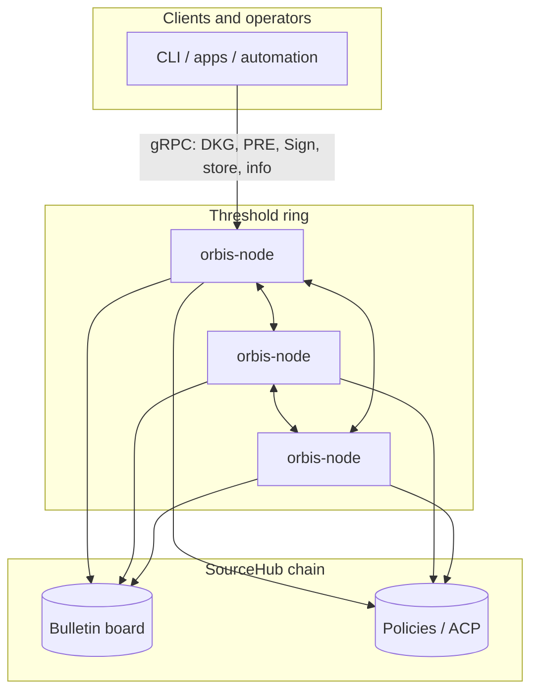
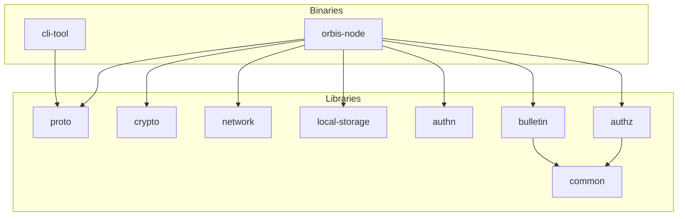

# Orbis

A Rust implementation of threshold cryptography with Distributed Key Generation (DKG), Proxy Re-Encryption (PRE), and Threshold signing protocols.

## Rust toolchain

This workspace tracks the latest stable Rust release rather than declaring a
minimum supported Rust version. Install updates before working on the project:

```bash
rustup update stable
```

The repository's `rust-toolchain.toml` selects the stable channel and installs
the `rustfmt` and `clippy` components. CI and Docker also build against the
latest stable toolchain.

## Overview

Orbis enables secure, distributed encryption where:
- A **ring** of nodes collaboratively generates a shared public key via DKG
- Data encrypted to the ring can only be decrypted by a threshold of ring nodes working together
- **Proxy Re-Encryption** allows the ring to transform ciphertext for a designated reader without exposing the plaintext

### Participants

- **Alice** - Encrypts data using the ring's aggregate public key
- **Bob** - Requests re-encryption and decrypts using his private key
- **Ring Nodes** - Threshold nodes that perform DKG and PRE operations
- **Eve** - Administrator who configures the ring (threshold, node count, cryptographic parameters)

## Architecture

```
orbis-rs/
├── crates/
│   ├── authn/          # JWT + did:key verification
│   ├── authz/          # Policy checks (SourceHub ACP)
│   ├── bulletin/       # Bulletin board (SourceHub)
│   ├── common/       # SourceHub chain client + Docker test harnesses
│   ├── crypto/       # DKG, PRE, threshold signing
│   ├── local-storage/# Encrypted key-value storage
│   ├── network/      # QUIC / iroh P2P abstraction
│   └── proto/        # gRPC service definitions
└── bin/
    ├── cli-tool/     # CLI client
    └── orbis-node/   # Ring node (gRPC + MPC) — see bin/orbis-node/README.md
```

Crate-level documentation: each of the directories above has or can have a **`README.md`** (e.g. [`crates/crypto/README.md`](crates/crypto/README.md), [`bin/orbis-node/README.md`](bin/orbis-node/README.md)).

## Bird's eye view

Two diagrams: **runtime** (what talks to what in deployment) and **codebase** (how the workspace fits together). They render on GitHub; in other viewers you may need a Mermaid-capable preview.

### Runtime (deployment)



- **gRPC** — control plane: start ceremonies, submit ciphertext, fetch node info.  
- **QUIC (iroh)** — data plane between ring nodes: MPC messages for DKG, PRE, and signing.  
- **Chain** — shared bulletin records (rings, stored secrets metadata) and access-control policy evaluation.

### Codebase (repository)



**`common`** is the SourceHub / Cosmos client shared by **`authz`** and **`bulletin`**. **`crypto`** is swappable (e.g. BLS12-381 vs decaf377) via Cargo features; **`network`** provides QUIC; **`local-storage`** holds encrypted key material on disk.

## Crates

### [`crypto`](crates/crypto/)

Cryptographic abstractions for DKG and PRE protocols with a BLS12-381 implementation.

**Traits:**
| Trait | Description |
|-------|-------------|
| [`Dkg`](crates/crypto/src/trait.rs) | 4-phase Distributed Key Generation protocol |
| [`ThresholdDealer`](crates/crypto/src/trait.rs) | Proxy Re-Encryption with threshold verification |
| [`PolynomialCommitment`](crates/crypto/src/trait.rs) | Polynomial commitment with share verification |
| [`PubPoly`](crates/crypto/src/trait.rs) | Public polynomial evaluation |
| [`CryptoSerialize`](crates/crypto/src/trait.rs) | Generic crypto type serialization |
| [`CryptoDeserialize`](crates/crypto/src/trait.rs) | Generic crypto type deserialization |

### [`network`](crates/network/)

Trait-based P2P networking using QUIC (via Iroh).

**Traits:**
| Trait | Description |
|-------|-------------|
| [`Network`](crates/network/src/trait.rs) | Main interface for peer connections |
| [`Connection`](crates/network/src/trait.rs) | Bidirectional peer communication |
| [`ProtocolHandler`](crates/network/src/trait.rs) | Handle incoming protocol connections |
| [`Router`](crates/network/src/trait.rs) | Manage multiple protocol handlers |
| [`RouterBuilder`](crates/network/src/trait.rs) | Builder pattern for router configuration |

### [`local-storage`](crates/local-storage/)

Encrypted local key-value storage for persisting node secrets.

**Traits:**
| Trait | Description |
|-------|-------------|
| [`LocalStorage`](crates/local-storage/src/trait.rs) | Key-value storage with optional AES-256-GCM encryption |

### [`common`](crates/common/)

SourceHub blockchain client (**`SourceHubClient`**, **`ChainConfig`**, **`TxSigner`**), ACP/bulletin helpers, and Docker-based test containers. See [`crates/common/README.md`](crates/common/README.md).

### [`proto`](crates/proto/)

gRPC `.proto` files and tonic-generated Rust types for node APIs.
See [`crates/proto/README.md`](crates/proto/README.md).

Go type generation uses buf and protoc.
See  [`gen/go`](gen/go). 
Generation tooling is pinned using go tools in [`go.mod`](go.mod)

### [`orbis-node`](bin/orbis-node/)

Main ring node binary: gRPC services, iroh MPC router, coordinators, PSS scheduler. See [`bin/orbis-node/README.md`](bin/orbis-node/README.md).

## Swappable Implementations

Orbis uses a trait-based architecture where core functionality is defined by traits, with multiple interchangeable implementations selectable via Cargo feature flags. This allows you to choose the right backend for your deployment environment.

### Feature Flag Pattern

Each crate with multiple implementations:
1. Defines a trait for the core functionality
2. Provides multiple implementations behind feature flags
3. Exports the selected implementation as a type alias (e.g., `LocalStorageImpl`)
4. Enforces mutual exclusivity at compile time

```bash
# Use default implementation
cargo build

# Use alternative implementation
cargo build --no-default-features --features=<alternative>
```

### Available Implementations

| Crate | Feature | Implementation | Description | Default |
|-------|---------|----------------|-------------|---------|
| `local-storage` | `redb` | `RedbStorage` | Persistent embedded DB (redb) | Yes |
| `local-storage` | `memory` | `MemoryStorage` | In-memory HashMap (testing only) | No |
| `network` | `iroh` | `IrohNetwork` | QUIC-based P2P (iroh) | Yes |
| `crypto` | `bls12-381` | `DKG, PRE, SIGN` | BLS12-381 curve | Yes |
| `crypto` | `decaf377` | `DKG, PRE, SIGN` |  Decaf377 curve | No |
| `authz` | `sourcehub` | `SourceHubAuth` | SourceHub authorization | Yes |
| `authz` | `dummy` | `DummyAuthZ` | Permissive (testing only) | No |
| `bulletin` | `sourcehub` | `SourceHubBulletin` | Bulletin board backends | Yes |
| `bulletin` | `dummy` | `DummyBulletin` | Permissive (testing only) | No |

### Example: Switching Storage Backend

```bash
# Default: uses redb for persistent storage
cargo build

# Testing: use in-memory storage (no persistence)
cargo build --no-default-features --features=memory

# Error: cannot enable both
cargo build --features=memory
# error: Features 'memory' and 'redb' are mutually exclusive.
```

### Implementing a New Backend

To add a new implementation (e.g., `sqlite` for local-storage):

1. Add the feature to `Cargo.toml`:
   ```toml
   [features]
   default = ["redb"]
   redb = []
   memory = []
   sqlite = []  # new
   ```

2. Add mutual exclusivity checks and export in `lib.rs`:
   ```rust
   #[cfg(feature = "sqlite")]
   pub mod sqlite;

   #[cfg(all(feature = "sqlite", feature = "redb"))]
   compile_error!("Features 'sqlite' and 'redb' are mutually exclusive.");
   #[cfg(all(feature = "sqlite", feature = "memory"))]
   compile_error!("Features 'sqlite' and 'memory' are mutually exclusive.");

   #[cfg(feature = "sqlite")]
   pub use sqlite::SqliteStorage as LocalStorageImpl;
   ```

3. Implement the trait in `src/sqlite/mod.rs`

## Protocol Flow

### Phase 1: Ring Setup (DKG)

```
┌─────────┐     ┌─────────┐     ┌─────────┐
│ Node 1  │     │ Node 2  │     │ Node 3  │
└────┬────┘     └────┬────┘     └────┬────┘
     │               │               │
     │ 1. Generate polynomial        │
     │    & commitment               │
     │──────────────────────────────►│
     │◄──────────────────────────────│
     │               │               │
     │ 2. Exchange encrypted shares  │
     │──────────────────────────────►│
     │◄──────────────────────────────│
     │               │               │
     │ 3. Verify & compute final     │
     │    secret share + public key  │
     │               │               │
```

### Phase 2: Encryption & Re-Encryption (PRE)

```
┌───────┐         ┌──────────┐         ┌───────┐
│ Alice │         │   Ring   │         │  Bob  │
└───┬───┘         └────┬─────┘         └───┬───┘
    │                  │                   │
    │ 1. Encrypt with  │                   │
    │    ring's PK     │                   │
    │─────────────────►│                   │
    │                  │                   │
    │                  │ 2. Bob requests   │
    │                  │    re-encryption  │
    │                  │◄──────────────────│
    │                  │                   │
    │                  │ 3. Ring nodes     │
    │                  │    produce shares │
    │                  │──────────────────►│
    │                  │                   │
    │                  │ 4. Bob recovers   │
    │                  │    & decrypts     │
    │                  │                   │
```

### Phase 3: Threshold Signing

```
┌───────┐         ┌──────────┐         ┌──────┐
│ Client│         │   Ring   │         │Verify│
└───┬───┘         └────┬─────┘         └──┬───┘
    │                  │                  │
    │ 1. Request       │                  │
    │    signature on  │                  │
    │    a message     │                  │
    │─────────────────►│                  │
    │                  │                  │
    │                  │ 2. Nodes run     │
    │                  │    threshold     │
    │                  │    signing;      │
    │                  │    combine shares│
    │                  │                  │
    │ 3. Return        │                  │
    │    aggregate     │                  │
    │    signature     │                  │
    │◄─────────────────│                  │
    │                  │                  │
    │ 4. Check valid   │                  │
    │    under ring    │                  │
    │    public key    │─────────────────►│
    │                  │                  │
```

The **Verify** step may be done by the **Client** (local check) or anyone holding the ring’s aggregate public key from DKG. Interactive schemes (e.g. FROST) add nonce rounds between ring nodes before partial signatures are produced.

## Quick Start

### Running a Node

```bash
# Build the project
cargo build --release

# Run a node (default address [::1]:50051)
./target/release/orbis-node

# Run with custom address and debug logging
./target/release/orbis-node --addr 127.0.0.1:8080 --log-level debug
```

### Configuration

**Password for encrypted storage** (checked in order):
1. File: `~/.orbis_password`
2. Environment: `ORBIS_PASSWORD` (development and CI only)
3. Interactive prompt

For production, provision secrets through a secrets manager or mounted file with
owner-only permissions (`0600`). Avoid `ORBIS_PASSWORD` and `ORBIS_SECRET_KEY` in
shell history, container environment blocks, compose files, or images. The sample
Docker compose files use fixed test credentials only for local development; see
[`bin/orbis-node/README.md`](bin/orbis-node/README.md#secure-secret-provisioning)
for the node hardening checklist.

Cross-origin browser gRPC-Web access is disabled by default. Node operators can
use repeatable `--cors-allow-origin <ORIGIN>` flags for trusted frontends or
explicitly opt into the previous open policy with `--cors-permissive`; see
[`bin/orbis-node/README.md`](bin/orbis-node/README.md#browser-cors).

### gRPC Services

- **DKG Service** - Initiate and participate in distributed key generation
- **PRE Service** - Request proxy re-encryption for designated readers

## Development

```bash
# Run all tests
cargo test

# Run tests for a specific crate
cargo test -p crypto
cargo test -p network
cargo test -p local-storage
cargo test -p authz

# Run tests for a different impl
cargo test --no-default-features --features=decaf377,redb

# Check compilation
cargo check

# Run with tracing
RUST_LOG=debug cargo run -p orbis-node

# Docker 3 node network (for testing only)
docker compose -f docker/docker-compose.3-node.yml up

# With default impl
docker compose -f docker/docker-compose-integration-test.yml build

# Docker for integration test with different impl
ORBIS_INTEGRATION_CRYPTO=decaf377 docker compose -f docker/docker-compose-integration-test.yml build

# Metrics network test (3 nodes + Prometheus + Grafana)
docker compose -f docker/docker-compose-metrics-network-test.yml up --build

# follow test logs 
docker compose -f docker/docker-compose-integration-test.yml logs -f node1 node2 node3                                                                                                                                            
```

### Metrics & Monitoring

The metrics compose file (`docker/docker-compose-metrics-network-test.yml`) spins up 3 Orbis nodes alongside Prometheus and Grafana.

**Ports:**

| Service    | Host Port | Description              |
|------------|-----------|--------------------------|
| Grafana    | 3000      | Dashboard UI             |
| Prometheus | 9099      | Metrics scrape endpoint  |
| node1      | 9091      | Node metrics (`/metrics`)|
| node2      | 9092      | Node metrics (`/metrics`)|
| node3      | 9093      | Node metrics (`/metrics`)|

Grafana is auto-provisioned on startup:
- **Prometheus data source** is pre-configured pointing at `http://prometheus:9090`
- **Orbis Node Metrics** dashboard loads automatically under the **Orbis** folder

Open [http://localhost:3000](http://localhost:3000), log in with `admin` / `admin`, and the dashboard will be ready.

Provisioning files live in `docker/grafana/` and are mounted into the container at startup.

To load these dashboards into a Grafana instance that doesn't support file-based provisioning (e.g. a Kubernetes Grafana, where there's no host volume to mount), use `docker/grafana/sync-dashboards.sh push` instead — it uploads the dashboard JSON over Grafana's HTTP API. Point it at another instance with `GRAFANA_URL` (and `GRAFANA_API_KEY`, or `GRAFANA_USER`/`GRAFANA_PASSWORD`). Run `sync-dashboards.sh dump` to pull dashboard edits made in the Grafana UI back into the repo. See the script header for full usage.

## Documentation

- **Crate READMEs** — [`crates/crypto`](crates/crypto/README.md), [`crates/network`](crates/network/README.md), [`crates/common`](crates/common/README.md), [`bin/orbis-node`](bin/orbis-node/README.md), and other crates under `crates/` and `bin/`.
- **Diagrams** — Sequence diagrams in [`docs/SequenceDiagrams/`](docs/SequenceDiagrams/).

## Security

- Private keys and secret shares are **never logged**
- Only public keys and metadata appear in trace output
- Local storage uses AES-256-GCM with Argon2 key derivation
- All share transmissions include nonces and session IDs to prevent replay attacks
- Nodes **fully trust their configured SourceHub endpoints** (no light-client
  verification of chain reads) — production nodes must run their own SourceHub
  full node; see [Chain endpoint trust](bin/orbis-node/README.md#chain-endpoint-trust-hard-requirement)

## License

Orbis-rs is licensed under the [Business Source License 1.1](licenses/Bsl.txt)
