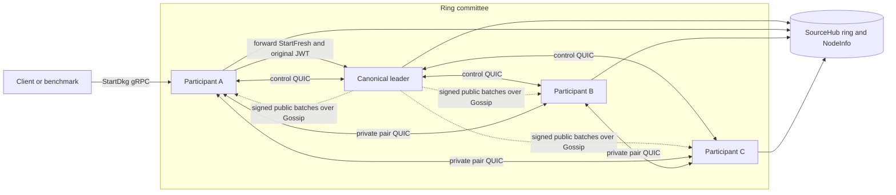
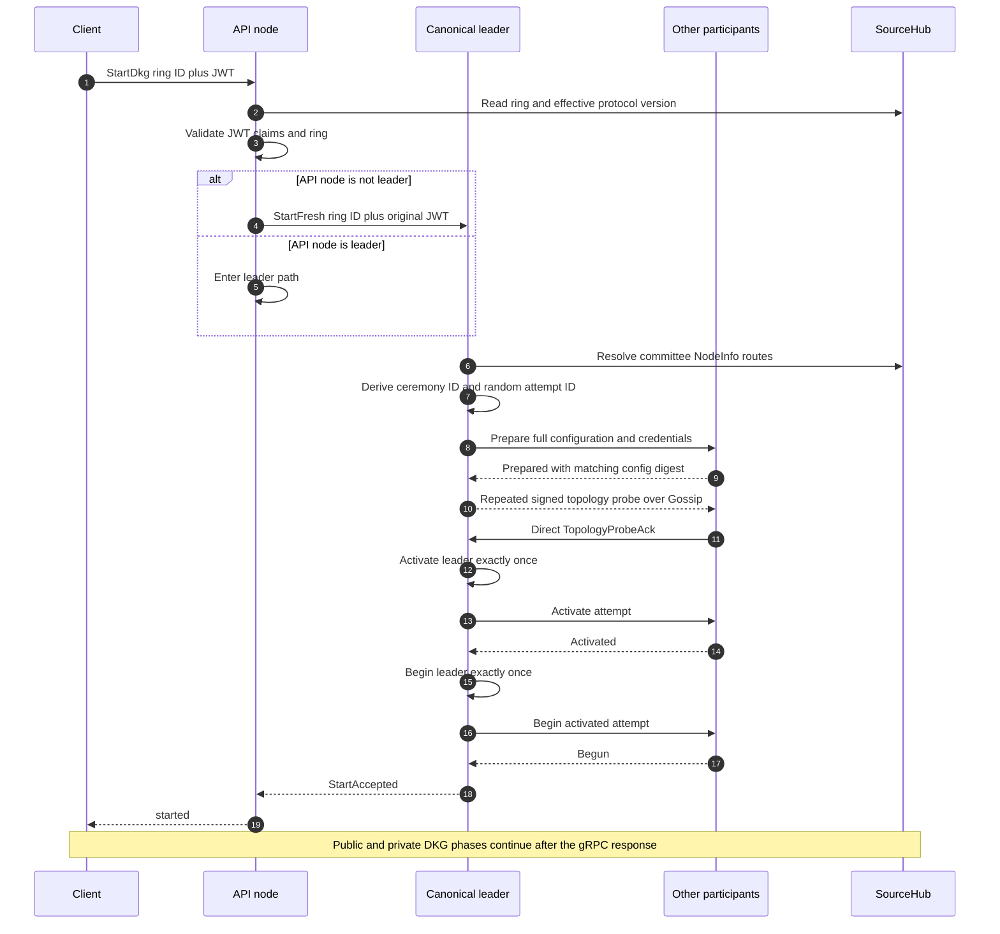
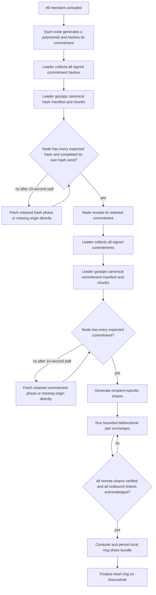
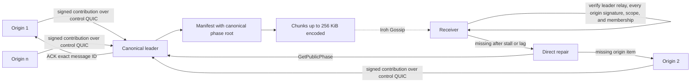
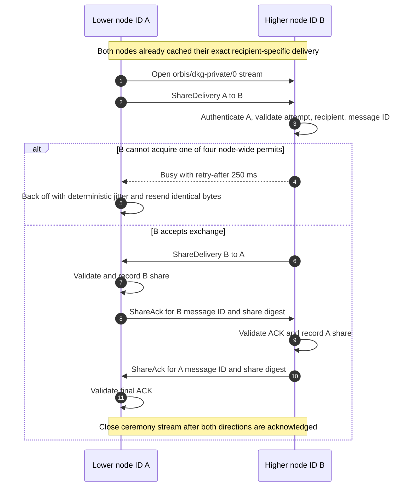
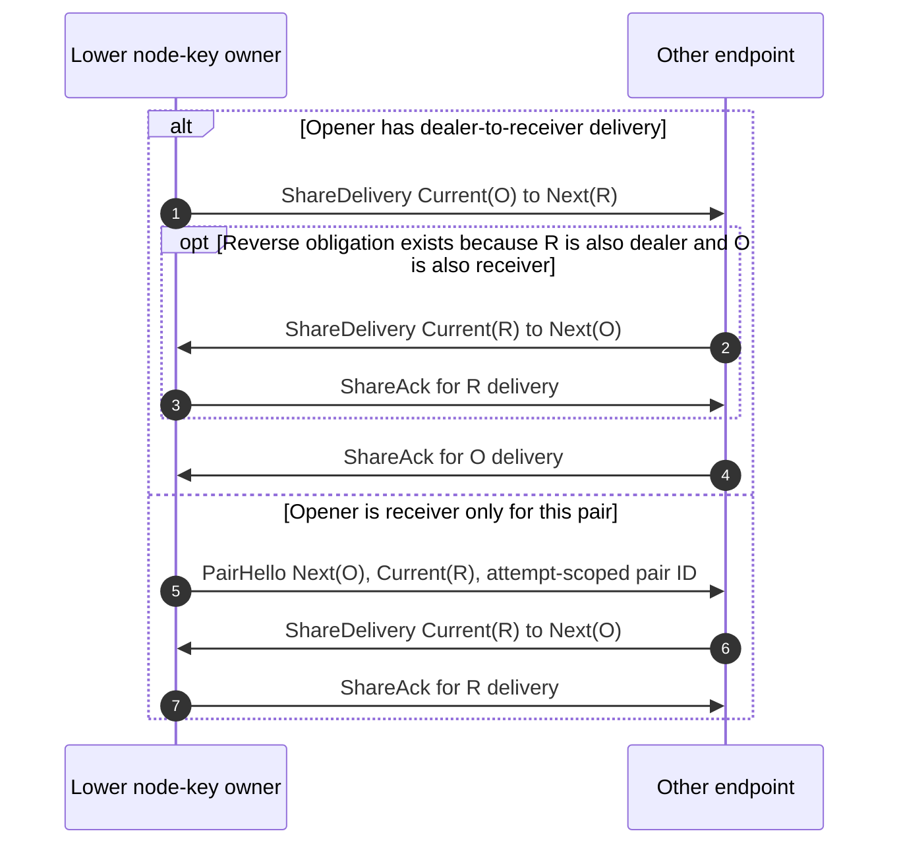
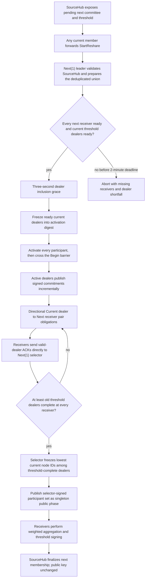
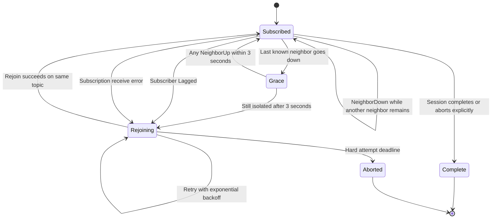
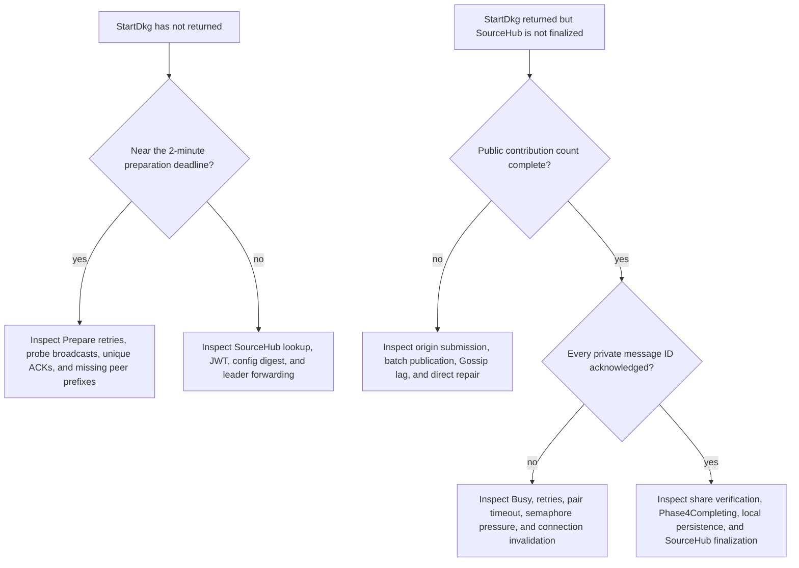

# Orbis DKG Networking and Ceremony Guide

This document describes the networking behavior implemented by the current
`orbis-node`. It is the source of truth for fresh DKG, PSS refresh, and PSS
reshare transport.
[`new_dkg_flow.md`](new_dkg_flow.md) is a design record, not an implementation
contract.

The most important fact is that Orbis does not send every DKG message with the
same mechanism. Every DKG-backed ceremony uses one transport with three
strictly separated planes:

| Plane | Carries | Transport | Visibility |
| --- | --- | --- | --- |
| Control | Start forwarding, credentials, prepare, readiness, activate, abort, repair requests | Authenticated direct QUIC | Only the two endpoints |
| Public | Topology probes, commitment hashes, commitments, reshare participant sets, audits, refresh health result | Authenticated Iroh Gossip, with direct QUIC repair | Observable to members of the transient topic |
| Private | Recipient-specific shares and digest acknowledgements | Authenticated bidirectional QUIC pair exchange | Only the two endpoints |

There is no alternate DKG wire path or fallback sender. PRE and SIGN are
separate protocols and remain bounded direct request/response operations.

## Contents

- [Architecture at a glance](#architecture-at-a-glance)
- [Non-negotiable protocol properties](#non-negotiable-protocol-properties)
- [Identity, leadership, and attempt isolation](#identity-leadership-and-attempt-isolation)
- [Starting a ceremony](#starting-a-ceremony)
- [Preparation and topology barrier](#preparation-and-topology-barrier)
- [Fresh DKG phase flow](#fresh-dkg-phase-flow)
- [Public contribution transport](#public-contribution-transport)
- [Private share transport](#private-share-transport)
- [PSS refresh](#pss-refresh)
- [PSS reshare](#pss-reshare)
- [Gossip churn and completeness repair](#gossip-churn-and-completeness-repair)
- [Retries, deadlines, and cleanup](#retries-deadlines-and-cleanup)
- [Security boundaries](#security-boundaries)
- [Scaling model](#scaling-model)
- [Observability and debugging](#observability-and-debugging)
- [Code map and tests](#code-map-and-tests)

## Architecture at a glance

The ceremony's canonical leader coordinates transport readiness and public
batching. Fresh DKG and refresh use the current committee's lowest signing key;
reshare uses the next committee's lowest signing key. The leader does not
perform the other nodes' cryptography and cannot manufacture a valid
contribution for them. Every participant still validates inputs, maintains its
own DKG state machine, generates its own polynomial and shares when its role
requires them, and persists its own final ring material.



The installed v0 DKG routes are:

| Purpose | ALPN |
| --- | --- |
| DKG control and direct repair | `orbis/dkg-control/0` |
| DKG private pair exchanges | `orbis/dkg-private/0` |
| Public dissemination | Native `iroh-gossip` ALPN |

All direct requests open a lightweight stream on a pooled QUIC connection. The
pool is global, keyed by `(peer, ALPN)`, bounded to 256 entries, and evicts the
least recently used entry. A stream timeout can invalidate precisely the parent
connection it used without deleting a newer connection installed concurrently.

## Non-negotiable protocol properties

The three-plane transport changes delivery, not the cryptographic DKG semantics.

1. **Every configured fresh/refresh participant is still a dealer.** Fresh DKG
   does not form a qualified subset when a dealer is absent.
2. **Fresh and refresh prepare every participant.** Reshare instead requires
   every next-committee receiver and at least the current threshold of ready
   dealers, then freezes the ready dealer set.
3. **Complete public phases name every expected origin.** Incremental reshare
   batches name an authenticated non-empty subset and are independently rooted.
4. **Every required recipient-specific share must be delivered and acknowledged.** A
   threshold such as 34-of-50 does not permit 16 nodes to disappear during
   fresh DKG.
5. **Threshold controls later use of a fresh key and dealer eligibility in
   reshare.** It does not let fresh DKG omit unavailable dealers and is not a
   liveness quorum for the current fresh-DKG construction.
6. **Private data never enters the public type.** The public wire enum cannot
   encode a JWT, credential, DKG share, or private invalid-share evidence.
7. **Retries replay retained bytes.** A connection replacement must not
   regenerate a polynomial or share.

Supporting a DKG that succeeds with an unavailable subset is a separate
robust-DKG/qualified-dealer design, not a transport retry policy.

## Identity, leadership, and attempt isolation

Orbis uses several related identifiers because they solve different problems.

| Identifier | Lifetime | Purpose |
| --- | --- | --- |
| Ring ID | Long-lived | SourceHub object being initialized or refreshed |
| Node signing key | Long-lived | Canonical committee identity stored in SourceHub |
| Iroh endpoint identity | Node endpoint lifetime | Authenticates QUIC and signed Gossip payloads |
| Canonical node ID | One committee ordering | Compact `1..=n` cryptographic participant number |
| Committee scope | One attempt | Distinguishes `Current(1)` from `Next(1)` during reshare |
| Ceremony ID | One logical ceremony | Deterministic duplicate-start protection |
| Attempt ID | One retry | Random 256-bit separation from stale traffic |
| Message ID | One contribution or share | Content-bound deduplication and acknowledgement |
| Topic ID | One attempt | Isolates transient Gossip traffic |

### Canonical leader

Fresh DKG and refresh choose the lexicographically lowest current-committee
node signing key in SourceHub. Reshare chooses the lexicographically lowest
next-committee signing key, which is also next-committee node ID 1 and the
participant-set selector. Every node can derive these results without an
election. Canonical numeric node IDs are derived independently for the current
and next committees.

If `StartDkg` reaches a nonleader, that node forwards `StartFresh` and the
original JWT to the leader. The leader and every follower independently validate
the ring configuration and credentials during preparation.

Refresh's leadership rule has one exception: unlike fresh DKG and reshare,
where only the single canonical leader is ever accepted, a refresh `Prepare`
is accepted from **any** current-committee member (still route-verified
against SourceHub `NodeInfo`). This lets refresh survive an unreachable
canonical leader — see [PSS refresh](#pss-refresh) for the forward-chain walk
that decides who actually leads a given attempt.

### Content and attempt binding

All derivations are domain-separated SHA-256 hashes:

- the committee digest binds the current committee and optional next committee
  without collapsing equal numeric IDs across scopes;
- the configuration digest binds the ceremony, attempt, topic, leader,
  threshold, routes, node-ID assignments, ceremony kind, policy, and ring;
- the topic ID binds chain ID, ring ID, committee digest, ceremony ID, and
  attempt ID;
- a public message ID binds ceremony, attempt, phase, origin, optional
  recipient, and the serialized payload;
- a private message ID binds ceremony, attempt, scoped sender, scoped recipient, share bytes,
  and nonce through a private-share digest;
- a public phase root binds the canonically ordered map of scoped origins to
  message IDs.

For reshare, the activation digest additionally binds the frozen active-dealer
set. A prepared but excluded current dealer therefore cannot inject a valid
commitment or private delivery into the activated attempt.

The logical ceremony ID prevents concurrent duplicate starts from creating two
sessions. A new random attempt ID ensures that delayed Gossip, direct responses,
or acknowledgements from an earlier failed attempt are rejected.

## Starting a ceremony

`DkgService::StartDkg` is a synchronous **readiness** call, not a synchronous
completion call. Success means the leader has prepared and activated every
committee member. It does **not** mean the ring is already finalized on
SourceHub.

PSS refresh and PSS reshare both start through a forwarding mechanism, but
they tolerate different failures. For reshare, any current member that
observes the pending transition sends an authenticated, idempotent
`StartReshare` request to the fixed canonical next-committee leader; there is
no fallback if that specific receiver is unreachable, since every
next-committee receiver is required regardless of who triggers the attempt.
That receiver independently rereads SourceHub, creates the attempt, and
prepares the deduplicated union of current and next committee endpoints. For
refresh, every current member's scheduler independently walks the committee
in canonical order once a refresh is due, asking each candidate in turn to
lead; the first reachable candidate becomes leader for that attempt — see
[PSS refresh](#pss-refresh). Once a current member receives `Prepare` for
either ceremony, subsequent scheduler ticks observe its active attempt and
stop forwarding.



This distinction matters to callers and benchmarks:

- request acknowledgement latency ends when `StartDkg` returns;
- end-to-end fresh-DKG latency ends when SourceHub finalization is visible and
  every committee node exposes matching local ring state.

## Preparation and topology barrier

Preparation deliberately finishes before any node publishes a polynomial
commitment or sends a share.

### Step 1: prepare candidate participants

The leader prepares itself first, then sends `PrepareSession` concurrently to
the required committee or union. A participant:

1. verifies that the named leader is canonical and is the authenticated sender;
2. recomputes and verifies the complete configuration digest;
3. validates SourceHub state, ring parameters, credentials, and node-ID mapping;
4. creates or reuses the local session;
5. subscribes to the attempt's transient Gossip topic, bootstrapping from the
   leader route;
6. starts exactly one topic listener;
7. returns `Prepared` with the same configuration digest.

The configuration contains a current `CommitteeConfig` and, for reshare, a next
`CommitteeConfig`. Each includes node signing keys, authenticated peer routes,
canonical node-ID assignments, and threshold. An overlapping physical node has
one network endpoint but can hold both a current-scoped dealer identity and a
next-scoped receiver identity.

An identical duplicate `Prepare` returns `Prepared` without creating another
session or subscription. A conflicting attempt for the same deterministic
ceremony is rejected.

Network and timeout failures are retryable. Authentication, configuration, and
invalid-response failures are terminal.

### Step 2: prove public-topic reachability and freeze reshare dealers

`Prepared` proves that local setup succeeded; it does not prove the participant
can receive Gossip traffic. The leader therefore creates one random nonce and
one serialized `TopologyProbe`, records itself as acknowledged, and republishes
the same semantic probe every 500 ms until every committee endpoint has sent a
direct acknowledgement.

The authenticated Gossip delivery envelope has a fresh delivery ID on each
broadcast so Iroh does not suppress an intentional retransmission. The DKG
probe inside that envelope keeps the same ceremony ID, attempt ID, and nonce.

Each follower listener owns at most one acknowledgement worker for that nonce.
The worker sends the same `TopologyProbeAck` to the leader, retrying from 250 ms
with exponential backoff capped at two seconds. Duplicate probes do not create
duplicate workers. Once the leader accepts the acknowledgement, later duplicate
probes are ignored by that follower.

The leader stores acknowledgements by canonical endpoint identity:

- an identical duplicate is idempotent;
- a noncommittee sender is rejected;
- a wrong nonce is rejected;
- a stale attempt is rejected;
- a unique valid acknowledgement is counted exactly once.

Fresh DKG and refresh require `Prepared` plus a topology acknowledgement from
every committee member. Reshare requires both from every next-committee
receiver and from at least the current threshold of dealers. Once that condition
is reached, the leader waits a three-second inclusion grace period so additional
ready current dealers can join; the wait is skipped if all current dealers are
already ready. The resulting current-scoped dealer set is frozen into the
activation digest.

If reshare preparation fails, the error reports missing next receivers and the
current-dealer shortfall separately. Prepared current-only nodes excluded from
the frozen set receive an idempotent abort/cleanup. Their persisted old ring
material is retained until SourceHub finalizes a committee that excludes them.

### Step 3: activate, then begin once

Only the ceremony-specific readiness condition opens the activation barrier.
The leader first records activation on its own session and then activates every
follower. Fresh and refresh activate the whole committee. Reshare activates
every next receiver plus the frozen current dealers; an overlapping node that
missed dealer inclusion can still activate as a receiver. Activation records
the frozen configuration but does not start polynomial work.

Only after every participant has returned `Activated` does the leader cross a
second, idempotent `Begin` barrier locally and at every follower. The first
valid `Begin` starts cryptographic work asynchronously; `Begun` acknowledges
that start without holding the control stream open for an entire public or
private phase. This two-step barrier prevents a fast dealer contribution or
pair exchange from reaching a participant that has prepared the attempt but
has not yet persisted its activation digest.

Activation has internal `Activated`, `AlreadyActivated`, and `StaleAttempt`
outcomes. Begin has corresponding `Begun`, `AlreadyBegun`, `NotActivated`, and
stale-attempt outcomes. Identical retries return success; only the first valid
Begin starts the cryptographic phase.

If the two-minute preparation deadline expires, the leader logs full missing
routes and returns a bounded error containing the missing endpoint-key prefixes.
The initiating nonleader waits an extra 30 seconds beyond the leader deadline so
that specific error can propagate instead of being hidden by a generic forward
timeout.

## Fresh DKG phase flow

Fresh DKG uses a commitment-hash pre-round. A dealer cannot choose its
commitment after observing the other dealers' revealed commitments.



The node-local state machine remains event driven:

```text
SessionSnapshot + DkgEvent -> Transition

Transition:
  next_phase: Option<DkgPhase>
  commands: Vec<DkgCommand>
```

`state_machine::transition` is pure. The driver snapshots and claims a phase
under the session lock, releases the lock, and only then runs cryptography,
network I/O, storage, SourceHub calls, or signing. Network handlers record a
validated local fact and emit an event; they do not directly force all nodes
through a shared global phase.

The relevant fresh-DKG transitions are:

| Local fact | State-machine command |
| --- | --- |
| All commitment hashes recorded and own hash send complete | Reveal retained commitment |
| All commitments recorded | Generate and exchange private shares |
| All required shares verified and aggregate material available | Enter single-flight Phase 4 completion |

Phase 4 persists a `RingShareBundle` containing the local share and public
polynomial. Fresh DKG also finalizes the ring on SourceHub. Completion is local
and durable: `Phase4Completing` is claimed before I/O, and `Phase4Complete` is
set only after durable work succeeds.

## Public contribution transport

Public data is not blindly gossiped by every dealer. It follows a signed
collection-and-relay flow.



### Origin submission

Each dealer creates a typed `DkgPublicContribution`, derives its message ID,
signs the serialized contribution with its Iroh endpoint identity, and retains
the exact signed envelope locally. Nonleaders submit that envelope directly to
the leader and require an acknowledgement for the same ceremony, attempt, and
message ID.

The leader verifies:

- the direct QUIC sender matches the signed envelope origin;
- the endpoint signature is valid for the public-contribution domain;
- the message ID matches the payload;
- the ceremony, attempt, committee digest, and phase are current;
- the origin node ID maps to that endpoint through the session's SourceHub
  `NodeInfo` routes.

An identical duplicate is accepted idempotently. A different signed envelope
for the same phase and origin is a conflicting duplicate and fails the attempt.

### Canonical batch publication

For fresh DKG and refresh complete phases, the leader waits for the exact
expected contribution count. Contributions are ordered by scoped canonical
origin. The leader then:

1. derives the phase root from the ordered `(origin node ID, message ID)` map;
2. splits signed envelopes into chunks using the exact encoded message size;
3. rejects any individual contribution larger than the 256 KiB chunk cap;
4. publishes a manifest containing the expected origins, phase root, and chunk
   count;
5. publishes the chunks over the transient Gossip topic.

Publication uses an attempt-scoped two-step claim. A phase or incremental
message is first marked in flight and is marked published only after the
manifest and every chunk in its immutable batch have been accepted by the
Gossip backend. If any send fails, the leader retries the exact encoded batch
from its manifest with bounded backoff until the attempt deadline. This makes
partial-send retransmission idempotent and prevents both concurrent publishers
and a transient failure from permanently suppressing publication.

Reshare commitments are threshold tolerant and do not wait for every frozen
dealer before dissemination. The leader coalesces newly retained contributions
for 50 ms, canonically orders each incremental batch, and flushes before the
256 KiB encoded cap. Each incremental manifest commits only to the exact
origins in that non-empty batch. A repeated identical contribution is
acknowledged but never republished.

The selector-signed reshare participant set is a complete singleton public
phase from `Next(1)`. Receivers reject a set unless every selected current
dealer is active and that receiver has already accepted the dealer's valid
commitment and share.

Receivers accept Gossip DKG messages only when the authenticated publisher is
the canonical leader — except for refresh, where any current-committee member
may be the leader for a given attempt (see [PSS refresh](#pss-refresh)).
Receivers buffer chunks by phase root, validate the manifest's exact origin set,
chunk indexes, canonical ordering, and root, then independently verify every
embedded origin signature and SourceHub membership before dispatching any
contribution from that batch into the local DKG state machine. Identical
retransmissions are idempotent. An authenticated contradiction — such as
conflicting complete roots, conflicting chunk contents, a manifest/content
mismatch, or two different origin-signed contributions for one phase — fails
the local attempt immediately. Missing manifests or chunks are availability
failures instead: they enter repair and eventually time out rather than being
treated as proof of malicious behavior. The leader is a relay and ordering
point, not a substitute signer.

### Completeness repair

Gossip is the efficient dissemination path, not the sole source of truth. Every
origin and the leader retain exact signed contributions for repair.

After activation, repair becomes eligible only when no session progress has
occurred for ten seconds. A receiver first walks the leader's retained public
phase in canonical, cursor-based pages. Every encoded page is capped at 512 KiB,
and the receiver rejects duplicate origins, regressing cursors, or pages that do
not make progress. A leader timeout, stream failure, explicit refusal, or
terminal page that leaves expected origins absent switches immediately to
direct-origin repair. Missing origins are queried concurrently, bounded by the
50-member committee limit, and one unavailable origin does not prevent valid
responses from the others from being retained and applied.
Direct repair is not manifest-gated: it verifies each retained origin signature,
message ID, attempt, and SourceHub endpoint binding before dispatch. This keeps
the independently authenticated origins as the recovery source when a Gossip
manifest or chunk was lost or the leader's repair endpoint is unavailable.
Malformed or contradictory authenticated leader/origin responses fail the exact
attempt; ordinary absence remains an availability failure.

Each current or next DKG committee is limited to 50 members. Besides bounding
ceremony and pairwise transport state, this also bounds a repair walk to at most
50 non-empty pages and 50 concurrent origin requests. Repair is single-flight
per attempt and phase. A round that retains nothing waits the 30-second maximum
repair backoff before retrying.

For reshare commitments, direct repair expects the frozen dealer set and fetches
missing retained contributions from the leader first, then from each scoped
authenticated origin. Commitment audits remain leader-only best-effort repair
because they are incremental diagnostics rather than an all-origins completion
phase. On subscriber lag, the node rejoins immediately and forces completeness
repair. Before activation, public repair is disabled; a prepared node cannot
generate a storm of requests for phases that have not started.

## Private share transport

A DKG share is recipient specific and never uses Gossip. Fresh and refresh have
both-direction obligations between every unordered committee pair. Reshare has
directional `Current dealer -> Next receiver` obligations. In all cases the
lower canonical node signing key in the relevant physical pair owns the logical
exchange. Fresh/refresh node IDs are sorted by those keys, so their lower ID is
also the opener.

Before opening anything, every node serializes and caches each outbound
`ShareDelivery`. The cached bytes include the ceremony, attempt, message ID,
sender and recipient IDs, share bytes, nonce, and optional private evidence.
Caching a conflicting byte string for the same message ID is rejected.



### Reshare pair shapes

Current and next numeric node IDs cannot be compared to choose a reshare
opener: `Current(1)` and `Next(1)` can refer to different nodes. Orbis resolves
both scoped identities to their SourceHub node signing keys and chooses the
lower key. Self-delivery is likewise detected by authenticated physical route,
not by equal numeric IDs.



The resulting shapes are:

| Shape | Stream sequence |
| --- | --- |
| Two directional obligations | opener delivery, responder delivery, opener ACK, responder ACK |
| Opener-only obligation | opener delivery, responder ACK |
| Responder-only obligation | `PairHello`, responder delivery, opener ACK |
| Same physical node | local validation and delivery; no stream |

`PairHello` is useful when the lower node-key owner is a next-committee
receiver with no outbound share. The current dealer may answer `Busy` until its
exact share has been generated and cached; the receiver retries the identical
attempt-scoped hello with bounded jitter. Overlapping dealer-receivers combine
the two opposite directional obligations on one stream when both are present.

The ordering makes the exchange symmetric: the opener does not receive a final
acknowledgement until it has acknowledged the opposite share. Both share
acknowledgements bind the complete attempt-scoped share digest.

### Backpressure and retry behavior

- One node-wide semaphore covers inbound and outbound exchanges.
- The default limit is four active endpoint-side exchanges per node.
- An inbound exchange waits up to 500 ms for a permit, then returns `Busy`.
- `Busy` recommends at least a 250 ms delay.
- Other retries start at 100 ms and use deterministic per-message jitter.
- Backoff doubles and is capped at 30 seconds.
- Each stream attempt is bounded by the ten-second peer-response timeout.
- The outer exchange continues only until the 15-minute hard attempt deadline.

If a stream or cached QUIC parent connection stops making progress, the precise
parent connection is evicted and the next retry reconnects. A valid `Busy`
response proves the connection is alive, so it is not evicted.

Most importantly, every retry resends `outgoing_bytes.clone()` from session
state. It never calls share generation again. Lost acknowledgements therefore
produce an identical share retransmission, which the receiver accepts
idempotently.

After all locally opened streams complete, a node still waits until every one of
its outbound message IDs—including those acknowledged on streams opened by
higher-ID peers—is recorded as acknowledged.

## PSS refresh

PSS refresh uses the same preparation, public contribution, private exchange,
repair, and hard-deadline machinery as fresh DKG. It has different
cryptographic and completion rules:

- any current-committee member may trigger a due refresh; its scheduler walks
  the committee in canonical order and the first reachable candidate leads
  the attempt (see [Refresh leader failover](#refresh-leader-failover));
- unlike fresh DKG and reshare, a refresh `Prepare` is accepted from any
  current-committee member, not only the fixed canonical leader;
- refresh starts with public commitments, without the fresh-DKG hash pre-round;
- private pair exchanges distribute the refreshing shares;
- the resulting local bundle is staged, not immediately promoted;
- the existing ring public key must remain unchanged;
- the leader, as canonical selector, obtains a threshold signature over a
  refresh health-check statement;
- a failed health check can publish a commitment audit;
- the health result uses a stage/publish/commit delivery barrier.

### Refresh leader failover

Unlike reshare, refresh has no single point of forwarding failure. Every
current-committee member's scheduler independently walks
`canonical_leader_candidates` (the committee sorted by node signing key) in
the same fixed order once a refresh is due. For each candidate: if it is the
local node, it coordinates the refresh itself; otherwise it sends a short,
single-shot `StartRefresh` request and waits up to the peer-response timeout.
A candidate that does not answer in time is skipped in favor of the next.
Because every observer uses the same order and tests real reachability rather
than a fixed target or a staggered timer, live members converge on the same
next-reachable candidate within seconds when the canonical leader is down or
partitioned — without waiting on the much slower health-check/kick pipeline.

A route that cannot be resolved at all — a committee member that never
published `NodeInfo` on SourceHub — is a chain-configuration gap, not a
reachability failure. Every node treats this as "not ready yet" and stands
down quietly rather than erroring, since no candidate can build a valid
`Prepare` without every member's route, regardless of rank.

If two candidates rarely and briefly both believe they should lead (an
asymmetric partition), the existing conflicting-attempt rejection in
[Preparation and topology barrier](#preparation-and-topology-barrier) bounds
the outcome to a wasted, unjoined attempt that times out and retries next
tick — not a split ceremony.

```mermaid
sequenceDiagram
  autonumber
  participant S as PSS scheduler (any current member)
  participant L as Leader for this attempt
  participant F as Followers
  participant G as Gossip topic

  Note over S,L: S walks the committee in canonical order until a reachable<br/>candidate answers a short StartRefresh request; that candidate becomes L
  S->>L: Ring is due after last_pss and grace check
  L->>F: Prepare, probe, and activate
  L->>F: Signed commitment batches and private pair exchanges
  F->>L: Signed contributions, shares, and acknowledgements
  L->>L: Stage refreshed bundle and verify unchanged public key
  F->>F: Stage refreshed bundles and verify unchanged public key
  L->>F: Threshold SIGN requests for health-check statement
  F->>L: Verified signature shares
  L->>F: StageRefreshResult with exact signed result
  F-->>L: Result staged ACK
  L->>G: Gossip health-result manifest and chunk
  L->>F: CommitRefreshResult
  F->>F: Apply result and promote or roll back staged bundle
  F-->>L: Result committed ACK
  L->>L: Promote or roll back local staged bundle
```

The two direct barriers prevent subscriber timing from splitting refresh state:

1. **Stage barrier:** every follower retains the exact signed result but does
   not promote its staged share.
2. **Public publish:** the result is also announced through the normal signed
   public plane for evidence and repair.
3. **Commit barrier:** only the authenticated leader's commit instruction
   applies the retained result. Duplicate commits use short-lived receipts and
   are acknowledged idempotently even if session cleanup has begun.

Successful refresh advances `last_pss`, changes the local polynomial/share
material, and preserves the ring public key.

## PSS reshare

Reshare rotates shares into a pending next committee while preserving the ring
public key. It uses the same control, public, and private planes, but its
liveness condition is intentionally different from fresh DKG: every new
receiver is required, while only the current threshold of old dealers must be
available. Leadership follows that liveness condition: the next committee's
canonical node ID 1 leads transport and selection, so no particular old dealer
is required.



The current committee and next committee each have independent canonical
node-ID assignments. Commitments may originate only from the frozen
`Current` dealer set. Shares may flow only from a frozen `Current` dealer to a
`Next` receiver. This scoped identity binding prevents equal old/new numeric
IDs from colliding in deduplication, message IDs, or routing.

Each receiver sends a direct, attempt-scoped, idempotent valid-share
acknowledgement to next-committee node ID 1. Once enough dealers have a valid
share at every receiver, the selector deterministically chooses the lowest old
node IDs among those threshold-complete dealers. The public participant set is
accepted only when it names active dealers for which the receiver has already
validated both commitment and share.

Invalid-share and commitment-equivocation evidence never enters Gossip. A new
receiver relays the signed evidence directly to active current-committee
members over control QUIC. Each relay has a scoped idempotency key, and duplicate
delivery cannot repeat report side effects.

Completion preserves the existing weighted aggregation, threshold signature,
SourceHub update, and public-key equality checks. An old-only node retains its
local bundle while the transition is merely pending—even if it was not selected
as an active dealer. After SourceHub visibly finalizes a committee that excludes
that node, the PSS reconciliation loop securely removes the stale bundle and
ring-index entry.

## Gossip churn and completeness repair

Iroh Gossip neighbor changes are normal mesh behavior. A `NeighborDown` event is
not itself a failure and no longer causes an immediate full-topic resubscribe.



The listener tracks the current neighbor set and remembers whether it has ever
had a neighbor. Rejoin behavior is:

| Event | Action |
| --- | --- |
| One neighbor leaves but others remain | Update the set; keep the topic and connections |
| Neighbor count reaches zero after previously being connected | Start a three-second isolation grace period |
| A neighbor returns during grace | Cancel isolation recovery |
| Isolation persists | Rejoin the same attempt topic, one attempt at a time |
| Subscriber reports `Lagged` | Rejoin immediately, then force direct completeness repair |
| Subscription receive fails | Treat as confirmed isolation and retry rejoin |
| Rejoin fails | Exponential retry capped at 30 seconds, bounded by the hard deadline |

Session removal aborts the topic listener and its acknowledgement/recovery
workers. Stale events are scoped out by attempt ID even if an old Gossip message
remains cached in the mesh.

## Retries, deadlines, and cleanup

The defaults are intentionally layered. Extending the outer deadline should not
be used to hide a dropped message; the shorter loops must repair it.

| Limit | Default | Applies to |
| --- | ---: | --- |
| Peer response timeout | 10 seconds | One direct control or private stream attempt |
| Topology probe interval | 500 ms | Repeated public readiness probe |
| Initial preparation retry | 250 ms | Prepare, activate, and probe ACK control retry |
| Preparation retry cap | 2 seconds | Prepare, activate, and probe ACK backoff |
| Gossip isolation grace | 3 seconds | Zero-neighbor confirmation |
| Public repair stall interval | 10 seconds | No-progress threshold after activation |
| Preparation deadline | 2 minutes | Prepare, join, probe, and activate all members |
| Forwarded-start margin | 30 seconds | Lets leader's preparation error reach API node |
| Repair/private retry cap | 30 seconds | Long-running attempt recovery |
| DKG transport hard attempt deadline | 15 minutes | Fresh DKG, refresh, or reshare attempt |
| QUIC keepalive | 10 seconds | Active peer connections |
| QUIC idle timeout | 5 minutes | Connection path health and inter-phase pauses |

DKG transport sessions remain repairable until explicit completion, explicit
abort, or the 15-minute hard attempt deadline. The expiration worker enforces
that hard deadline. Short-lived completed-session receipts are retained for up
to five minutes so a lost final response can be acknowledged idempotently.

When leader preparation fails, it sends best-effort `Abort` messages and removes
its local session. Completion or abort tears down transient topic state and
listener-owned tasks.

## Security boundaries

### What is authenticated

- QUIC authenticates the endpoint on every direct control and private stream.
- Authenticated pub-sub signs delivery envelopes with the Iroh endpoint key.
- Every relayed public contribution also has its own origin signature under the
  DKG public-contribution domain.
- The verified endpoint identity must match the committee route resolved from
  SourceHub `NodeInfo` for the claimed canonical node ID.
- Configuration, committee, topic, message, phase-root, and share-digest hashes
  are domain separated and attempt scoped.

### What is public and private

Public commitment material and ceremony metadata may be visible to peers that
join the transient topic. The attempt-derived topic is difficult to guess but
is **not group encryption** and must not be treated as confidentiality.

The following stay on authenticated direct QUIC and are unrepresentable by the
public publisher API:

- the original JWT and other credentials;
- recipient-specific share values and nonces;
- private share acknowledgements;
- private invalid-share evidence.

### What the leader can and cannot do

The leader can delay, omit, or reorder dissemination, which can affect
liveness. It cannot forge another origin's signed contribution. Canonical phase
roots make the expected ordered contribution set explicit, and direct-origin
repair removes the leader as the only recovery source for contributions that
origins have already generated and retained.

This is crash/reliability hardening, not a Byzantine reliable-broadcast proof.
The all-participants-required protocol still fails if a required participant
including the leader permanently disappears or refuses to generate valid
cryptographic material.

## Scaling model

Let `n` be ring size.

### Public phases

For each public phase:

- `n - 1` nonleaders submit one signed contribution directly to the leader;
- the leader handles its own contribution locally;
- the leader publishes one manifest plus however many bounded chunks are
  required;
- Gossip performs mesh dissemination;
- direct repair adds traffic only when delivery is incomplete.

This replaces application-level public all-to-all sends with `O(n)` leader
collection plus Gossip dissemination. The leader is deliberately the bandwidth
and verification concentration point for public phases.

Fresh DKG has two normal all-member public phases: commitment hashes and
commitments. Refresh normally has commitments and one leader health result;
commitment audit is conditional.

### Fresh and refresh private phase

Private shares remain fundamentally quadratic because every dealer has a unique
share for every other participant:

```text
successful-path pair streams = n(n - 1) / 2
directional share payloads = n(n - 1)
pair participations per node = n - 1
active endpoint-side exchanges per node <= 4 by default
```

Examples:

| Ring size | Successful-path pair streams | Directional private shares | Pair participations per node |
| ---: | ---: | ---: | ---: |
| 3 | 3 | 6 | 2 |
| 8 | 28 | 56 | 7 |
| 9 | 36 | 72 | 8 |
| 20 | 190 | 380 | 19 |
| 50 | 1,225 | 2,450 | 49 |

Without retries, the bidirectional design halves the number of stream
lifecycles relative to one stream per directional share. Retries can add
replacement streams. The semaphore prevents a 50-node ceremony from opening all
49 pair exchanges at one node simultaneously, but it does not turn private
share distribution into a subquadratic protocol.

### Reshare scaling

Let `d` be the frozen current-dealer count and `r` the next-receiver count.
Reshare has `d * r` directional share obligations before subtracting physical
self-deliveries for overlapping members. The number of QUIC pair streams is the
number of distinct physical node pairs with at least one obligation;
overlapping dealer-receivers can carry two opposing deliveries on one stream.
This remains quadratic when both committees grow together, while allowing
unavailable current dealers beyond the old threshold to be excluded during
preparation.

### Capacity interpretation

The node currently caps commitment coefficients at 256, concurrent DKG sessions
at 100, pooled peer/protocol connections at 256, and locally managed rings at
256. These are implementation/resource guards, not evidence that every ring up
to those values will satisfy a latency or reliability target.

Use [`../../../orbis-bench/README.md`](../../../orbis-bench/README.md) to
measure a recorded host and network profile. A single-host Docker run measures
that host plus Docker scheduling and synthetic network shaping; it is not a
universal protocol maximum.

## Observability and debugging

### Metrics

The following production metrics expose ceremony and transport behavior:

| Metric | Labels | Meaning |
| --- | --- | --- |
| `dkg_session_duration_seconds` | `kind`, `outcome` | End-to-end fresh, refresh, or reshare duration |
| `dkg_phase_duration_seconds` | `kind`, `phase` | Time spent in actual local DKG phases |
| `dkg_control_readiness_duration_seconds` | `kind` | Leader preparation start through all-member Begin acknowledgement |
| `dkg_public_transport_duration_seconds` | `phase`, `stage` | Leader collection and Gossip dissemination |
| `dkg_private_pair_duration_seconds` | `outcome` | Endpoint-side private pair exchange duration |
| `dkg_private_active_exchanges` | none | Current endpoint-side private exchanges |
| `dkg_transport_events_total` | `plane`, `event` | Bounded transport event counts |
| `dkg_transport_messages_total` | `plane`, `message`, `direction` | Typed DKG message counts by plane |
| `p2p_gossip_neighbors` | `protocol` | Current Gossip neighbor count |
| `p2p_messages_sent_total` / `received_total` | `protocol` | P2P message counts |
| `p2p_bytes_sent_total` / `received_total` | `protocol` | P2P byte counts |
| `pss_scheduler_delay_seconds` | none | Delay from refresh due time to scheduler observation |

Useful `dkg_transport_events_total` events include:

- control: `probe_ack`, `preparation_retry`, `activated`, `abort`, `retry`,
  `connection_invalidated`, `reshare_next_leader_selected`,
  `reshare_start_forwarded`, `reshare_start_accepted`, `reshare_start_duplicate`,
  `reshare_start_rejected`, `refresh_start_forwarded`,
  `refresh_failover_leader_selected`, and `refresh_start_rejected`;
- public: `probe_broadcast`, `probe_broadcast_failure`, `contribution`,
  `batch_published`, `batch_publish_retry`, `batch_publish_abandoned`,
  `neighbor_down`, `rejoin_isolation`, `rejoin_lag`,
  `rejoin_subscription_error`, `rejoin_failure`, `repair`, `origin_repair`,
  `result_staged`, `result_stage_barrier`, `result_committed`, and
  `result_commit_barrier`;
- private: `busy`, `retry`, `inbound_timeout`, `connection_invalidated`, and
  `pair_completed`.

`pair_completed` and the pair-duration histogram are endpoint-side
observations; both endpoints execute and observe their side of one bidirectional
exchange. Do not treat a raw event total as a unique unordered-pair count without
accounting for that.

### Locating a stall



Common log landmarks are:

| Log text | Interpretation |
| --- | --- |
| `Authenticated StartDkg request; forwarding to canonical DKG leader` | API validation succeeded |
| `topology preparation barrier expired` | Preparation failed; log fields include full missing routes |
| `submitting signed public DKG contribution` | Origin retained and is sending a public item |
| `leader published canonical public DKG batch` | All expected contributions for that public phase reached leader |
| `requesting direct public DKG completeness repair` | Follower has stalled with missing public data |
| `opening private DKG pair exchange` | Lower canonical node is attempting a pair |
| `private DKG pair exchange completed` | Both directional shares on that stream were digest-acknowledged |
| `invalidated stalled private DKG connection` | A stream timeout caused precise parent-connection eviction |
| `Phase 4: DKG complete! Final share computed` | Local durable completion reached the final share step |

Preparation timeout errors include the operation, peer-key prefix, ceremony ID,
and attempt-ID prefix. A topology barrier failure additionally names every
missing endpoint-key prefix. Preserve those fields and targeted participant
logs in benchmark evidence.

### Benchmarking

Plan a suite without starting containers:

```console
cargo run -p orbis-bench -- plan --config bin/orbis-bench/examples/50-node.yaml
```

Run a focused case in the foreground:

```console
cargo run -p orbis-bench -- run --network-size 50 --ring-size 9 --threshold 8
```

Run the versioned suite:

```console
cargo run -p orbis-bench -- run --config bin/orbis-bench/examples/50-node.yaml
```

Keep `manifest.json`, `trials.jsonl`, metrics deltas, resource samples, resolved
Compose/genesis files, and failed-participant logs with any reported capacity
number. Report the largest all-pass ring observed for that recorded hardware,
crypto implementation, Docker allocation, and LAN/WAN profile—not a universal
maximum.

## Code map and tests

### DKG transport

| Area | File |
| --- | --- |
| Start forwarding, prepare barrier, Gossip listener, repair, public relay, private exchange | [`v0/network.rs`](v0/network.rs) |
| Type-safe control/public/private messages and ID derivations | [`v0/transport.rs`](v0/transport.rs) |
| Attempt state, acknowledgement sets, exact retained bytes, cleanup | [`v0/session_state.rs`](v0/session_state.rs) |
| ALPN descriptors | [`../../../../crates/network/src/protocol.rs`](../../../../crates/network/src/protocol.rs) |
| Authenticated Iroh pub-sub | [`../../../../crates/network/src/iroh/pubsub.rs`](../../../../crates/network/src/iroh/pubsub.rs) |
| Bounded connection pool and private semaphore | [`../app_state.rs`](../app_state.rs) |
| Timeouts and resource caps | [`../constants.rs`](../constants.rs) |
| Production metrics | [`../metrics.rs`](../metrics.rs) |

### Cryptographic state machine

| Area | File |
| --- | --- |
| Pure transitions | [`v0/coordinator/state_machine.rs`](v0/coordinator/state_machine.rs) |
| Commitment-hash pre-round | [`v0/coordinator/phases/phase0.rs`](v0/coordinator/phases/phase0.rs) |
| Commitment reveal/public submission | [`v0/coordinator/phases/phase1.rs`](v0/coordinator/phases/phase1.rs) |
| Share creation and pair-exchange entry | [`v0/coordinator/phases/phase2.rs`](v0/coordinator/phases/phase2.rs) |
| Durable finalization and refresh staging | [`v0/coordinator/phases/phase4.rs`](v0/coordinator/phases/phase4.rs) |
| Refresh threshold health check | [`v0/coordinator/refresh_health_check.rs`](v0/coordinator/refresh_health_check.rs) |
| Fresh DKG gRPC entrypoint | [`v0/service.rs`](v0/service.rs) |
| PSS scheduling | [`../pss/v0/mod.rs`](../pss/v0/mod.rs) |

### Reshare state machine

Reshare transport orchestration lives in [`v0/network.rs`](v0/network.rs),
while weighted aggregation, selector logic, SourceHub finalization, and
role-specific completion live in
[`v0/coordinator/reshare`](v0/coordinator/reshare). Reshare commitments and the
selector-signed participant set use the public plane; shares, credentials, and
invalid-share or equivocation evidence cannot be represented by its wire type.

### Focused checks

```console
cargo test -p orbis-node dkg::v0::transport
cargo test -p orbis-node dkg::v0::network::stability_tests
cargo test -p orbis-node dkg::v0::session_state
cargo test -p orbis-node dkg::v0::tests::dkg
cargo test -p orbis-node dkg::v0::tests::refresh
cargo test -p orbis-node dkg::v0::tests::reshare
cargo test -p orbis-node dkg::v0::coordinator::reshare::selection
cargo test -p orbis-node pss::v0::tests
cargo test -p network
```

When changing this code, preserve these engineering rules:

1. Keep public and private wire types structurally separate.
2. Validate authenticated endpoint identity against SourceHub committee routes.
3. Keep the state-machine transition function pure.
4. Claim transitions while holding the session lock; run side effects after
   releasing it.
5. Retain exact outbound public contributions and private shares until their
   delivery contract is satisfied.
6. Make duplicate preparation, activation, and Begin requests idempotent.
7. Do not repair public phases before activation or before the no-progress
   interval.
8. Treat ordinary Gossip neighbor churn as normal; rejoin only after confirmed
   isolation, lag, or subscription failure.
9. Bind reshare IDs to scoped participant identities and freeze the active
   current-dealer set into the activation digest.
10. Interpret threshold as a key-use threshold, not permission to omit dealers
    during fresh DKG.
