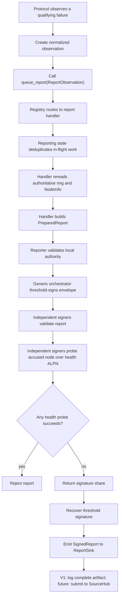

# MPC fault reporting

This folder owns the fault-reporting framework for the MPC node. Protocols such
as PRE, DKG, PSS, and signing should only submit normalized observations here;
report construction, validation, threshold signing, and delivery should stay in
this module.

The first supported report type is `node_offline`. It is intentionally small:
PRE can keep serving the user while reporting tries, in the background, to
produce a threshold-signed artifact proving that a committee member appears
offline.

## High-level flow



## `node_offline` flow

1. PRE sends requests normally and continues with reachable peers.
2. If a peer-specific transport failure completes, PRE submits an
   `ReportObservation::NodeOffline(OfflineObservation)` through `queue_report`.
3. The PRE result is not delayed or changed by reporting.
4. Reporting routes the observation to `NodeOfflineHandler`.
5. Reporting collapses concurrent duplicates by the handler-owned key:
   `(report_type, ring_id, subject_key)`.
6. The handler rereads the current ring and `NodeInfo` from the bulletin instead
   of trusting the PRE call site.
7. The handler builds a canonical `ReportEnvelope` and derives
   `report_id = SHA256(canonical_report_bytes)`.
8. The reporter counts as one threshold signer because it directly observed the
   transport failure.
9. The accused node is excluded from signing, but original MPC node IDs are
   preserved.
10. Other signers independently validate the report and perform three
   challenge/response health probes over at most five seconds.
11. Any successful probe means the accused node is reachable, so the signer
    rejects the report.
12. If enough independent peers agree, the coordinator recovers the threshold
    signature under the ring key.
13. The completed `SignedReport` goes to the configured `ReportSink`.

## What qualifies as an offline observation

Only completed peer-specific transport failures should create an offline
observation:

- connection/open-stream failure;
- send failure;
- receive failure;
- response timeout.

These should not create `node_offline` reports:

- peer application errors;
- malformed responses;
- invalid shares;
- verification failures;
- canceled stragglers after PRE already has enough shares.

The payload must stay sanitized. `NodeOffline` records only the originating
protocol/version and committee scopes. It must not include JWTs, object IDs,
ciphertexts, raw error text, or transport sub-stage details.

## Common validation gates

Before anyone signs, the report handler should verify:

- the envelope domain is supported;
- the report type is registered;
- the report has not expired;
- the chain ID matches the configured bulletin;
- the ring is finalized;
- the ring public key and canonical ring-state digest match current bulletin
  state;
- reporter and accused are distinct members of their declared committee scopes;
- `NodeInfo` peer IDs match the report;
- the requester peer matches the reporter `NodeInfo`;
- the local signer is a current committee member;
- the local signer is not the accused node;
- the threshold is at least two;
- the threshold can still be met while excluding the accused node.

This means `t=1` rings cannot report faults, and `t=n` rings cannot report one
offline member using the existing threshold.

## Signing behavior

Reports reuse the normal sign coordinator through a dedicated
`SignContext::Report` path.

- BLS signers perform report validation and health probing before returning
  their signature share.
- FROST signers perform report validation and health probing before nonce
  generation. Round two is bound to the exact report digest through the nonce
  context key, so the signer does not need to probe twice.
- The accused node is excluded from requests, expected peer sets, nonce
  collection, and final share collection.
- Exclusion is by node key, not by reindexing the committee, so MPC node IDs stay
  stable.

## Health protocol

The health check uses the reporting ALPN:

```text
orbis/reporting/health/0
```

The probe is intentionally simple:

1. signer opens a stream to the accused peer;
2. signer sends a nonce challenge and expiry;
3. accused peer echoes the nonce;
4. matching response proves reachability and rejects the offline report.

All probe failures are treated as evidence of unreachability for that signer.
One successful probe by any signer is enough for that signer to refuse the
report.

## Report sink

The current sink is log-only. It emits the complete signed artifact and leaves a
TODO for future SourceHub submission.

The chain should follow the Rust canonical types and golden vectors later; do
not make the chain define a competing encoding.

## Adding a new report type

To add another fault path:

1. define a canonical payload in `types.rs`;
2. add a normalized observation type and `ReportObservation` variant;
3. implement a `ReportHandler` that prepares `PreparedReport` and validates it;
4. register the handler in the default registry;
5. add a thin adapter at the protocol failure site;
6. call `queue_report` with the new observation variant.

The protocol module should classify and submit observations. It should not own
report envelopes, health probing, threshold-signing policy, or chain delivery.

## Test expectations

Each report type should have coverage for:

- canonical encoding and golden vectors;
- report ID/domain separation;
- expiry behavior;
- registry dispatch and unknown report types;
- in-flight deduplication and cleanup;
- stale ring state and pending reshare rejection;
- identity mismatch and self-report rejection;
- `t=1` and `t=n` threshold rejection;
- health probe success rejecting a report;
- below-threshold validation producing no signed report;
- final signature verification under the ring key for both BLS and FROST builds.
