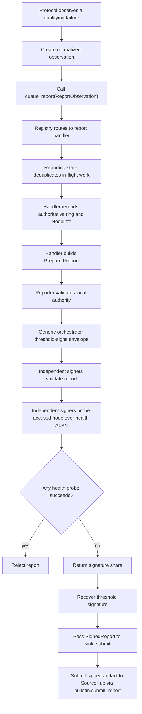

# MPC fault reporting

This folder owns the fault-reporting framework for the MPC node. Protocols such
as PRE, DKG, PSS, and signing should only submit normalized observations here;
report construction, validation, threshold signing, and delivery should stay in
this module.

Supported report types are `node_offline` and
`pre_invalid_reencryption_proof`. They are intentionally small: protocols can
keep serving the user while reporting tries, in the background, to produce a
threshold-signed artifact proving that a committee member appears offline or
returned an attributable invalid PRE proof.

## High-level flow



## `node_offline` flow

1. PRE sends requests normally and continues with reachable peers.
2. If a peer-specific transport failure completes, PRE submits an
   `ReportObservation::NodeOffline(OfflineObservation)` through `queue_report`.
3. The PRE result is not delayed or changed by reporting.
4. Reporting routes the observation to `NodeOfflineHandler`.
5. Reporting collapses concurrent duplicates by the handler-owned key:
   `(report_type, ring_id, subject_key)`.
6. The handler rereads the current ring and `NodeInfo` from the bulletin instead
   of trusting the PRE call site.
7. The handler builds a canonical `ReportEnvelope` and derives
   `report_id = SHA256(canonical_report_bytes)`.
8. The reporter counts as one threshold signer because it directly observed the
   transport failure.
9. The accused node is excluded from signing, but original MPC node IDs are
   preserved.
10. Other signers independently validate the report and perform three
   challenge/response health probes over at most five seconds.
11. Any successful probe means the accused node is reachable, so the signer
    rejects the report.
12. If enough independent peers agree, the coordinator recovers the threshold
    signature under the ring key.
13. The completed `SignedReport` goes to the configured `ReportSink`.

## What qualifies as an offline observation

Only completed peer-specific transport failures should create an offline
observation:

- connection/open-stream failure;
- send failure;
- receive failure;
- response timeout.

These should not create `node_offline` reports:

- peer application errors;
- malformed responses;
- invalid shares / verification failures (these create
  `pre_invalid_reencryption_proof` reports instead — see below);
- canceled stragglers after PRE already has enough shares.

The payload must stay sanitized. `NodeOffline` records only the originating
protocol/version and committee scopes. It must not include JWTs, object IDs,
ciphertexts, raw error text, or transport sub-stage details.

## `pre_invalid_reencryption_proof` flow

A PRE responder signs every `ReencryptResponse` with its secp256k1 chain key
(`NodeSigningKey`; the ring-registered `node_key` is exactly that key's
compressed public key hex). The signature covers a canonical
`PreReencryptResponseStatement`: domain tag (`orbis-pre-reencrypt-response-v1`),
chain_id, ring_id, ring_pk, ring_state_sha256, protocol_version, request_id,
`signed_at` (unix seconds at response time), responder_node_key, object_id,
rdr_pk, optional derivation, from_node_id, share, challenge, proof, and the
crypto backend name. The coordinator rebuilds the statement from its own
context, so any disagreement (or a missing/forged signature) rejects the
response outright — a share is only usable if it is fully attributable.

When a signature-valid response fails `dealer.verify()` (the NIZK does not
verify against the ring polynomial), the coordinator queues a
`pre_invalid_reencryption_proof` observation carrying the signed statement as
evidence — inline during collection, or via the response drain if the result
arrives after threshold. Deserialization failures stay unreported (corruption
in transit is not misbehavior), and a stale/future `signed_at` rejects the
response the same way a bad signature does.

Signer-side validation (no health probe for this type):

- statement↔envelope binding: chain_id, ring_id, ring_pk, ring_state digest,
  `request_id == session_id`, `responder_node_key == accused_node_key`;
- accused node-id mapping: `from_node_id` must equal the accused's canonical
  DKG index in the current ring;
- evidence signature: secp256k1 verify under `accused_node_key`;
- **evidence anchor**: `observed_at == signed_at - CHAIN_BLOCK_GRACE_SECS`
  (exactly). This pins the envelope's fixed `observed_at + REPORT_TTL_SECS`
  expiry to the evidence's age, so the shared shape checks already reject
  stale or future evidence and the chain's plain TTL dedupe records provably
  outlive any resubmission of the same evidence — one accepted report per
  (request, accused), ever, with no extra retention rules;
- re-verification: fetch the document by object_id from the bulletin
  (authoritative enc_cmt), load the local `RingPolyState` polynomial, and run
  `verify()` on the evidence — if the proof actually verifies, refuse to sign
  (anti-framing gate).

Notes: `session_id` is the PRE `request_id`, so chain session-dedupe yields
per-request demerits ("keep submitting invalid proofs, keep getting
demerited"). Demerit weight is the ring's `pre_invalid_proof_demerits`
(DemeritConfig; feeds the cross-repo ring-state digest). The
`response_signature`/`signed_at` wire fields are mandatory — all ring nodes
must upgrade together. A node whose shares went stale (e.g. it missed a PSS
refresh) produces honestly-signed proofs that fail verification and will be
demerited; like `node_offline`, the report attributes fault, not intent.

## Common validation gates

### orbis-rs signer-side gates

Before anyone signs, the report handler should verify:

- the envelope domain is supported;
- the report type is registered;
- the report has not expired;
- the chain ID matches the configured bulletin;
- the ring is finalized;
- the ring public key and canonical ring-state digest match current bulletin
  state;
- reporter and accused are distinct members of their declared committee scopes;
- `NodeInfo` peer IDs match the report;
- the requester peer matches the reporter `NodeInfo`;
- the local signer is a current committee member;
- the local signer is not the accused node;
- the threshold is at least two;
- the threshold can still be met while excluding the accused node.

This means `t=1` rings cannot report faults, and `t=n` rings cannot report one
offline member using the existing threshold.

### sourcehub chain-side gates

Independently, before accepting `MsgSubmitReport` and applying demerits, the
chain re-checks most of the same invariants plus its own replay protection
(see [Chain-side acceptance](#chain-side-acceptance-sourcehub) above):

- envelope shape and validity-window checks;
- `report.chain_id` matches the running chain;
- `report_id` matches the recomputed canonical hash;
- `report_id` has not already been accepted (artifact replay protection);
- ring is finalized and `ring_pk`/`ring_state_sha256` are current;
- `origin_protocol_version` is the ring's effective version at `observed_at`;
- committee authorization (threshold >= 2, threshold satisfiable excluding
  the accused, reporter in the signing committee, accused in the accused
  committee, accused `NodeInfo.peer_id` still matches);
- session dedupe (`sessionDedupeID` has not already been accepted);
- threshold signature verifies under `ring.ring_pk`.

The chain does not trust the orbis-rs signers' validation — it re-derives
everything it can from on-chain state and only takes the threshold signature
as proof that signers agreed, not as a substitute for re-checking ring/committee
freshness itself.

## Signing behavior

Reports reuse the normal sign coordinator through a dedicated
`SignContext::Report` path.

- BLS signers perform report validation and health probing before returning
  their signature share.
- FROST signers perform report validation and health probing before nonce
  generation. Round two is bound to the exact report digest through the nonce
  context key, so the signer does not need to probe twice.
- The accused node is excluded from requests, expected peer sets, nonce
  collection, and final share collection.
- Exclusion is by node key, not by reindexing the committee, so MPC node IDs stay
  stable.

## Health protocol

The health check uses the reporting ALPN:

```text
orbis/reporting/health/0
```

The probe is intentionally simple:

1. signer opens a stream to the accused peer;
2. signer sends a nonce challenge and expiry;
3. accused peer echoes the nonce;
4. matching response proves reachability and rejects the offline report.

All probe failures are treated as evidence of unreachability for that signer.
One successful probe by any signer is enough for that signer to refuse the
report.

## Report sink

`sink::submit` forwards the completed `SignedReport` to SourceHub by calling
`bulletin.submit_report`. The canonical encoding and golden vectors are defined
on the Rust side; the chain should not introduce a competing encoding.

## Chain-side acceptance (sourcehub)

`MsgSubmitReport` is handled by `x/orbis/keeper/SubmitReport`, which delegates to
`validateSubmittedReport` (`x/orbis/keeper/report.go`) before applying any state
change:

1. validate envelope shape (domain, non-empty fields, `ring_state_sha256` is
   32-byte hex, `observed_at <= expires_at`, validity window is exactly the
   120s `ReportTTLSeconds`, not expired, reporter != accused);
2. `report.chain_id` matches the running chain;
3. recompute the canonical message and `report_id` from the envelope and
   compare against the claimed `report_id` — mismatch is rejected;
4. `HasAcceptedReport(report_id)` — reject if this exact signed artifact was
   already accepted;
5. decode and validate the report payload: `node_offline` checks
   `origin_protocol` is one of `pre`/`sign`/`pss_refresh`/`pss_reshare`, while
   `pre_invalid_reencryption_proof` binds the signed PRE response statement to
   the envelope;
6. look up the ring, require it finalized, and require `report.ring_pk` /
   `report.ring_state_sha256` to match current on-chain ring state exactly
   (stale ring state is rejected, same as the orbis-rs gate);
7. check `origin_protocol_version` is the ring's *effective* protocol version
   for `observed_at` (handles upgrade-boundary timing);
8. `validateReportCommitteeAuthorization`: resolve the accused/signing
   committees for their declared scopes (`current` or `pending_new`), require
   `threshold >= 2`, require the threshold is still satisfiable with the
   accused excluded, require the reporter is in the signing committee and the
   accused is in the accused committee, and require the accused's current
   on-chain `NodeInfo.peer_id` still matches the report's `accused_peer_id`;
9. **session dedupe** — a second, independent check from `report_id` (see
   below) — reject if this `(ring, report_type, origin_protocol, accused,
   session_id)` tuple was already accepted;
10. verify the threshold signature over the canonical envelope bytes under
    `ring.ring_pk`.

Only after all of that does the keeper call `IncrementNodeDemerits` and emit
`EventReportAccepted`.

### Two distinct dedupe keys

- **`report_id`** = `SHA256(canonical envelope bytes)`, where the canonical
  bytes include every field of the envelope (domain, ids, timestamps,
  payload, `session_id`, ...). This prevents the literal same signed artifact
  from being submitted twice.
- **`sessionDedupeID`** = `SHA256(domain, chain_id, ring_id, report_type,
  origin_protocol, accused_node_key, session_id)`. This is a coarser key that
  prevents two *different* reports both claiming to cover the same session
  from landing (e.g. two honest-but-redundant submissions of the same
  underlying incident).

Both records are pruned by `EndBlock` once the report's own 120s TTL has
elapsed. That's safe to do unconditionally: the envelope's own
`observed_at`/`expires_at` window already makes the report unsubmittable past
that point regardless of whether the dedupe record still exists, so there's
no replay gap opened by forgetting it.

## Demerits

`DemeritAmountForReportType` (`x/orbis/keeper/demerits.go`) maps each report
type to a point value: `node_offline` uses
`ring.DemeritConfig.NodeOfflineDemerits`, and
`pre_invalid_reencryption_proof` uses
`ring.DemeritConfig.PreInvalidProofDemerits`.
`IncrementNodeDemerits` (`x/orbis/keeper/store.go`) then adds that amount to the
node's running total for `(ring_id, node_key)`. The total lives in a lazily-reset
window: if the existing window started more than `DemeritConfig.ResetIntervalSeconds`
ago, it's treated as expired and a fresh window starts at the current point total
of `amount` rather than continuing to accumulate indefinitely.

## Adding a new report type

To add another fault path:

1. define a canonical payload in `types.rs`;
2. add a normalized observation type and `ReportObservation` variant;
3. implement a `ReportHandler` that prepares `PreparedReport` and validates it;
4. register the handler in the default registry;
5. add a thin adapter at the protocol failure site;
6. call `queue_report` with the new observation variant.

The protocol module should classify and submit observations. It should not own
report envelopes, health probing, threshold-signing policy, or chain delivery.

## Test expectations

Each report type should have coverage for:

- canonical encoding and golden vectors;
- report ID/domain separation;
- expiry behavior;
- registry dispatch and unknown report types;
- in-flight deduplication and cleanup;
- stale ring state and pending reshare rejection;
- identity mismatch and self-report rejection;
- `t=1` and `t=n` threshold rejection;
- health probe success rejecting a report;
- below-threshold validation producing no signed report;
- final signature verification under the ring key for both BLS and FROST builds.
