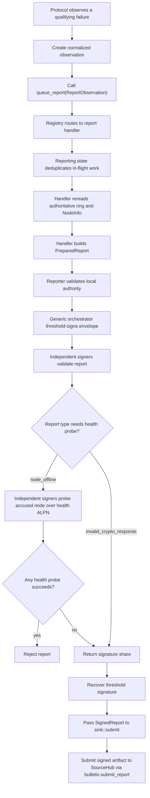

# MPC fault reporting

This folder owns the fault-reporting framework for the MPC node. Protocols such
as PRE, DKG, PSS, and signing should only submit normalized observations here;
report construction, validation, threshold signing, and delivery should stay in
this module.

Supported report types are `node_offline`, `invalid_crypto_response`, and
`unauthorized_request`. They are intentionally small: protocols can keep
serving the user while reporting tries, in the background, to produce a
threshold-signed artifact proving that a committee member appears offline,
returned an attributable bad cryptographic response, or relayed a request that
fails a re-check against Authz.

## High-level flow



## `node_offline` flow

1. PRE sends requests normally and continues with reachable peers.
2. If a peer-specific transport failure completes, PRE submits an
   `ReportObservation::NodeOffline(OfflineObservation)` through `queue_report`.
3. The PRE result is not delayed or changed by reporting.
4. Reporting routes the observation to `NodeOfflineHandler`.
5. Reporting collapses concurrent duplicates by the handler-owned key:
   `(report_type, ring_id, subject_key)`.
6. The handler rereads the current ring and `NodeInfo` from the bulletin instead
   of trusting the PRE call site.
7. The handler builds a canonical `ReportEnvelope` and derives
   `report_id = SHA256(canonical_report_bytes)`.
8. The reporter counts as one threshold signer because it directly observed the
   transport failure.
9. The accused node is excluded from signing, but original MPC node IDs are
   preserved.
10. Other signers independently validate the report and perform three
   challenge/response health probes over at most five seconds.
11. Any successful probe means the accused node is reachable, so the signer
    rejects the report.
12. If enough independent peers agree, the coordinator recovers the threshold
    signature under the ring key.
13. The completed `SignedReport` goes to the configured `ReportSink`.

## What qualifies as an offline observation

Only completed peer-specific transport failures should create an offline
observation:

- connection/open-stream failure;
- send failure;
- receive failure;
- response timeout.

These should not create `node_offline` reports:

- peer application errors;
- malformed responses;
- invalid shares / verification failures (these create
  `invalid_crypto_response` reports instead — see below);
- canceled stragglers after PRE already has enough shares.

The payload must stay sanitized. `NodeOffline` records only the originating
protocol/version and committee scopes. It must not include JWTs, object IDs,
ciphertexts, raw error text, or transport sub-stage details.

## `invalid_crypto_response` flow

`invalid_crypto_response` is the unified report type for attributable bad
cryptographic or authenticated protocol responses. Its canonical payload starts
with an evidence-kind tag followed by that kind's exact signed evidence.

The current evidence kinds are:

- `pre`: a signed `PreReencryptResponseStatement` for an invalid PRE proof.
  The statement domain is `orbis-pre-reencrypt-response-v1`, and
  `origin_protocol` must be `pre`.
- `sign`: a signed `SignResponseStatement` for an invalid threshold signature
  share. The statement domain is `orbis-sign-response-v1`, and
  `origin_protocol` may be `sign`, `pss_refresh`, `pss_reshare`, or `report`.
- `dkg_share`: a signed `DkgShareStatement` for an invalid raw PSS DKG share.
  The share statement domain is `orbis-dkg-share-v1`; it embeds a signed
  `DkgCommitmentStatement` with domain `orbis-dkg-commitment-v1`.
  `origin_protocol` must be `pss_refresh` or `pss_reshare`. Fresh/full DKG
  does not report bad raw shares.
- `dkg_invalid_refresh_commitment`: a signed Refresh commitment whose decoded
  constant term is non-identity. It is queued during public preflight before
  the original rejection aborts the attempt.
- `dkg_equivocation`: two signed PSS commitment statements from the same
  dealer and session nonce with different commitment bytes.
- `dkg_public_origin_fault`: one endpoint-signed invalid public contribution,
  or two conflicting endpoint-signed non-Commitment contributions from the
  same origin and attempt. The statement uses domain
  `orbis-dkg-public-origin-fault-v1`, retains the exact endpoint envelopes, and
  is limited to Refresh/Reshare. Commitment equivocation remains on the
  stronger `dkg_equivocation` path. This same `InvalidPayload` path also
  covers a Refresh result that fails preflight or dispatch over the
  `StageRefreshResult`/`CommitRefreshResult` direct-QUIC delivery barrier — a
  second, control-plane delivery route for the same `RefreshHealthCheckResult`
  contribution alongside its normal Gossip-batch path, kept reliable
  independently of Gossip.
- `dkg_leader_equivocation`: two conflicting endpoint-signed Gossip
  broadcasts (a manifest, or a chunk at the same index) from the same
  canonical public-plane leader for the same phase and coordinate. Unlike
  `dkg_public_origin_fault`, the fault is the leader's own batch-packaging
  claim, not any origin's contribution content — a leader who sends two
  different canonical manifests/chunks for one phase_root (or two different
  chunks at one index) breaks the single-canonical-batch guarantee the
  broadcast transport depends on. The statement uses domain
  `orbis-dkg-leader-equivocation-v1`, is limited to Refresh/Reshare (the
  accused committee scope follows `PrepareSession::leader_committee`: current
  for Refresh, pending-new for Reshare), and retains both raw signed
  deliveries plus each one's per-broadcast `delivery_id` (the randomized ID
  mixed into the Gossip topic-frame signing domain — see
  `crates/network/src/iroh/pubsub.rs`). Independent verification recomputes
  the topic ID from chain/ring/committee/ceremony/attempt binding and
  re-checks each endpoint signature via `PubSub::verify_topic_delivery`
  rather than trusting the reporter. A totally undecodable leader broadcast
  (fails to parse as any `DkgPublicMessage` at all) is not covered by this
  evidence kind — the endpoint signature that authenticated it at the
  transport layer is verified and then discarded before the DKG layer ever
  sees it, so there is currently nothing portable to retain for that case.
- `dkg_leader_public_fault`: a single endpoint-signed Gossip delivery (a
  manifest or chunk) that is independently provable as invalid on its own,
  with no conflicting counterpart needed — unlike `dkg_leader_equivocation`.
  The statement uses domain `orbis-dkg-leader-public-fault-v1` and retains
  the single raw signed delivery plus its `delivery_id`. Independent
  verification always re-checks the endpoint signature the same way as
  `dkg_leader_equivocation`; what else it checks depends on `fault_kind`:
  - `invalid_manifest`: the leader published a manifest naming the wrong
    origin set for its phase (fails `PhaseManifest::validate`), or whose
    `complete` flag contradicts the phase's Complete/Incremental publication
    mode. Re-derives the phase's expected origin set from chain-visible
    committee membership (`registry.rs`'s `expected_leader_manifest_shape`,
    using the same canonical node-ID assignment real ceremony setup uses)
    and re-runs `PhaseManifest::validate` against it.
  - `chunk_index_out_of_range`: a chunk whose `index` is `>=` the phase's
    expected origin count. Reuses the same chain-derivable bound as
    `invalid_manifest` (`expected_leader_manifest_shape(...).origins.len()`).
  - `oversized_chunk`: a chunk whose encoded size exceeds
    `MAX_PUBLIC_CHUNK_BYTES`. A pure byte-length check against a fixed
    protocol constant — no committee/ring lookup needed at all, so (unlike
    the other two kinds) this one is provable even for the Reshare
    `Commitments` phase.

  A report is only signable if the delivery is genuinely, independently
  provably wrong. **`invalid_manifest`/`chunk_index_out_of_range` are
  deliberately unsupported for the Reshare `Commitments` phase.** Its real
  expected-origins set is the ceremony's *active dealers*, a live,
  leader-determined value only cryptographically committed to via the
  leader's signed `activation_digest` (`ControlSignature`) — not derivable
  from `ring.peer_node_keys`/`new_peer_node_keys` alone. A report naming
  this phase (for those two kinds) is rejected outright rather than
  validated against a wrong/looser membership set.

  No relay path exists for this evidence kind (unlike
  `dkg_leader_equivocation`/`dkg_control_message_fault`) — a pure
  pending-new reshare receiver that alone detects a fault (no
  current-committee member also witnessed it) cannot report it. This is a
  deliberate, accepted gap, not an oversight: it only affects the two
  reshare phases where pending-new nodes are the ones watching
  (`CommitmentAudit`, `ReshareParticipantSet`); Refresh phases are
  unaffected since there is only ever one (current) committee.

  **Not covered by any `fault_kind` here**: an oversized direct-QUIC
  repair-page response — unlike Gossip chunks, `DkgControlMessage::
  PublicPhaseResponse` carries no reclaimable signature of its own
  (direct-QUIC control messages other than `Prepare`/`Prepared`/`Activate`/
  `Activated`/`Begin`/`Begun` were never given a `ControlSignature`), so
  there is nothing to authenticate that claim to a third-party co-signer.
  The leader's aggregate `BufferLimit` violations (too many pending
  manifest entries, too many buffered chunk contributions, too many
  distinct incremental batch roots) used to be uncovered here too — see
  `dkg_leader_batch_mismatch` below for why they're now structurally
  unreachable in the cases that matter.
- `dkg_leader_batch_mismatch`: two leader-signed Gossip deliveries (any
  combination of manifest and chunk) that each reference the same origin
  (same `ParticipantRef`, same `MessageId`) under two *different* phase
  roots. Reuses `DkgLeaderEquivocationStatement`'s wire shape verbatim (same
  "two signed deliveries, one phase" format) under its own domain
  (`orbis-dkg-leader-batch-mismatch-v1`) and evidence-kind tag — the fault
  predicate differs from `dkg_leader_equivocation` (shared origin across
  different coordinates, rather than identical coordinate with different
  content). Detected locally by `network.rs`'s `claim_origins`, called from
  both `insert_manifest` and `insert_chunk` (`PublicBatchAssembler`) — a
  origin-tracking check `insert_manifest` had no equivalent of before this
  kind existed. Independent verification re-checks both endpoint signatures
  the same way as `dkg_leader_equivocation`, decodes each delivery
  (a chunk's nested per-origin `SignedPayload`s are individually decoded
  too), and confirms the phase roots differ while at least one
  `(origin, message_id)` pair appears in both.

  **Why this closes the aggregate `BufferLimit` checks, not just
  `BatchMismatch`**: pairwise-disjoint non-empty origin subsets of an
  N-member committee can never sum past N. So once every origin-claiming
  delivery is checked against every other one it could conflict with (which
  `claim_origins` now does for both manifests and chunks — previously only
  chunks were checked, and only against other chunks), exceeding any of the
  aggregate buffer/root-count bounds becomes impossible without an earlier
  origin conflict already having fired, with strictly better (two real
  deliveries, not just a message id) evidence. The aggregate checks stay in
  the code as defensive backstops, not because they're expected to fire.
  **One case they remain the active, still-needed mechanism for**: the same
  origin appearing twice *within a single delivery's own contributions* —
  `claim_origins` only compares against already-recorded claims from
  *earlier* deliveries, not duplicates within the batch currently being
  validated.

  No relay path exists for this evidence kind yet either (see
  `dkg_leader_public_fault` above), though unlike that kind, one would be a
  much smaller lift here — the underlying relay mechanism and
  `DkgControlMessage` wire variant pattern already exist for
  `dkg_leader_equivocation` and could be mirrored directly.

**Evidence anchoring for these three kinds**: `PhaseManifest`/`DkgPublicMessage::
Chunk` each carry a `signed_at: u64` field — when the leader constructed that
delivery, authenticated for free by the same Gossip delivery signature every
other field here already relies on (no new signing scheme). Each statement's
top-level `signed_at` is derived from this rather than report-construction
time: the single decoded delivery's own `signed_at` for `dkg_leader_public_
fault`, or the later of the two decoded deliveries' for `dkg_leader_
equivocation`/`dkg_leader_batch_mismatch` (mirroring `dkg_public_origin_
fault`'s `OriginEquivocation` case and `dkg_equivocation`'s own fix — see
"DKG-specific expiry" below). Independent verification re-derives the same
value from the decoded delivery/deliveries and rejects a report whose claimed
`signed_at` doesn't match — otherwise a reporter could anchor to an arbitrary
value regardless of what the deliveries themselves say, defeating the point.
Before this, all three anchored to `now()` at report-construction time
instead, since `PhaseManifest`/`Chunk` had no timestamp field at all — meaning
these reports never really expired relative to when the leader fault actually
happened (an issue for the two kinds with a relay path, since each relay hop
would reset the clock again). **`dkg_control_message_fault` was deliberately
left out of this fix**: `ControlSignature` does carry a `signed_at`, but it
isn't covered by `control_ack_signing_bytes` — the actual signed bytes — so
it's an unauthenticated, self-reported claim. Wiring it in as-is would let an
accused leader/follower forge a favorable timestamp; a real fix needs
`control_ack_signing_bytes` extended to bind `signed_at` into what's signed,
which is a live protocol-message signing-scheme change (touches Prepare/
Prepared/Activate/Activated/Begin/Begun verification broadly, not just these
two fault-report paths) — out of scope for this pass.
- `dkg_control_message_fault`: a node-key-signed direct-QUIC control-handshake
  fault. Unlike the Gossip broadcasts covered above, direct-QUIC control
  messages (`Prepare`/`Prepared`/`Activate`/`Activated`/`Begin`/`Begun`) carry
  no reclaimable transport-layer signature — QUIC/TLS authentication proves
  identity to the two live endpoints, not a portable per-message artifact —
  so `PrepareSession` and each ack now carry an explicit
  `ControlSignature` over `(ceremony_id, attempt_id, message_kind, digest)`
  under the sender's own chain node key. Two fault kinds share the statement
  (domain `orbis-dkg-control-message-fault-v1`):
  - `leader_prepare_fault`: one signed `Prepare`, independently provable as
    invalid because it names a noncanonical leader, or because self-consistent
    committee routes it claims contradict current SourceHub `NodeInfo`/ring
    state. Reported at whichever point the specific, unambiguous failure is
    first detected — `prepare_participant` itself catches the noncanonical-
    leader case and (Reshare only) the new/next-committee route mismatch
    before any session exists; `handle_session_init`'s per-kind validators
    (`validate_refresh_init`/`validate_reshare_init`) catch the current/old-
    committee route mismatch for Refresh and Reshare respectively (Fresh DKG
    has the same check but isn't reportable — no ring exists yet to bind
    evidence to). Every one of these is reached only after the leader identity
    and `config_digest` self-consistency already passed, so there is no
    tampering ambiguity by the time any of them fires. A signature only covers
    `config_digest`, so before attributing fault the reporter recomputes
    `config_digest` from the full retained `Prepare` and only reports if it's
    self-consistent — otherwise a relay could tamper with `leader_node_key`/
    `committees` post-signature while leaving an innocent signer's original
    digest intact. Independent re-verification re-derives `noncanonical_leader`
    the same way, and re-checks route contradictions for *both* committees a
    Reshare Prepare names (old/current against the ring's still-current
    membership, new/next against the accused's claimed scope) regardless of
    which one the reporting node actually caught — since Reshare always
    attributes the accused via the new/next committee (the leader is always
    drawn from there), independently re-deriving only that one committee would
    silently reject an otherwise-valid old-committee report. Any
    current-committee recipient can queue this report directly; a pure
    pending-new reshare receiver that detects it cannot relay it yet (relaying
    needs the current-committee routing that normally comes from live session
    state, which by construction doesn't exist for a rejected `Prepare`).
  - `ack_equivocation`: two differently-signed acks
    (`Prepared`/`Activated`/`Begun`) from the same follower for the identical
    (ceremony, attempt, message_kind) request. A single wrong or stale-looking
    ack is not enough — that can happen honestly on a retry race — so this
    only fires when the same signer produces two genuinely different signed
    digests for the provably identical request. Detected leader-side as each
    response arrives, and reported/relayed the same way as the other DKG
    evidence kinds. Only the leader-observed direction is covered — a
    follower-side detector for the leader itself sending conflicting
    `Activate`/`Begin` messages is not built in this pass.

PRE, Sign, and nested DKG statements are signed by the accused node's
secp256k1 chain key (`NodeSigningKey`; the ring-registered `node_key` is exactly
that key's compressed public key hex). Public-origin and leader-equivocation
evidence instead retain the exact transport envelope(s) signed by the accused
node's registered endpoint identity. Control-message-fault evidence is signed
directly with that same chain node key (not the endpoint identity), since
direct-QUIC control messages have no transport-layer signature to reclaim. The
normalized statement carries chain/ring binding, the ring-state digest,
protocol version, request/session id, evidence timestamp, responder node key,
origin protocol, and protocol-specific material. Missing or invalid evidence
signatures reject the response or report outright; only signature-valid
evidence is attributable.

When a signature-valid response fails the protocol-specific verifier, the
protocol queues `ReportObservation::InvalidCryptoResponse`. The protocol should
still continue if it has enough valid responses. Deserialization failures,
malformed evidence, bad signatures, wrong sender/recipient bindings, and stale
or future `signed_at` values are rejected without reporting.

Signer-side validation (no health probe for this report type):

- statement↔envelope binding: chain_id, ring_id, ring_pk, ring_state digest,
  `request_id == session_id`, `responder_node_key == accused_node_key`;
- evidence origin and scope policy:
  - PRE: origin `pre`, current/current committee scopes;
  - Sign: origin `sign`, `pss_refresh`, `pss_reshare`, or `report`, using the
    statement's accused/signing committee scopes;
  - DKG evidence: origin `pss_refresh` or `pss_reshare`, with current signers
    and a current or pending-new accused as permitted by the evidence kind;
- evidence signature: secp256k1 verify under `accused_node_key`; DKG share
  reports also verify the nested DKG commitment signature;
- **evidence anchor**: `observed_at == signed_at - CHAIN_BLOCK_GRACE_SECS`
  (exactly). This pins the envelope's fixed `observed_at + REPORT_TTL_SECS`
  expiry to the evidence's age, so the shared shape checks already reject
  stale or future evidence and the chain's plain TTL dedupe records provably
  outlive any resubmission of the same evidence — one accepted report per
  (request, accused, origin), ever, with no extra retention rules;
- anti-framing re-verification: signers rerun the relevant cryptographic or
  authenticated-protocol check and refuse to sign unless the embedded evidence
  independently proves the claimed fault.

For PRE evidence, signers fetch the document by object_id from the bulletin
(authoritative enc_cmt), load the local `RingPolyState` polynomial, and run
`verify()` on the evidence. For Sign evidence, signers verify the signature
share against the signed message/commitments/context. For DKG share evidence,
signers verify the share against the accused's own signed commitment and only
report if `commitment.verify_share(to_node_id, share_value)` fails.

Raw DKG bad-share reporting is PSS-only. During refresh, the receiver is a
current committee member and queues the report directly. During reshare, a pure
pending-new receiver cannot sign a current-signed report, so it relays the
signed bad-share evidence to current committee peers. A current peer accepts a
relay only for `pss_reshare`, re-checks the evidence against the local session,
confirms the share verification failure, and then queues the report itself.

Notes: `session_id` is the evidence `request_id`, so chain session-dedupe yields
per-request demerits ("keep submitting invalid crypto, keep getting
demerited"). Demerit weight is the ring's
`invalid_crypto_response_demerits` (DemeritConfig; feeds the cross-repo
ring-state digest). The signed evidence wire fields are mandatory — all ring
nodes must upgrade together. Like `node_offline`, this report attributes fault,
not intent.

## `unauthorized_request` flow

`unauthorized_request` attributes a node that relayed a Sign/PRE request on
behalf of another node, where the acceptor's own ACP re-check on that request
failed. It exists because a relayer sits between the original caller and the
acceptor: the acceptor only sees the relayer's forwarded copy, so a relayer
that forwards something it should have rejected needs to be independently
attributable, the same way an invalid cryptographic response is.

1. A relaying node signs a `RelayRequestStatement` describing the request it's
   forwarding (chain/ring binding, `request_id`, `origin_protocol`, actor/object
   ids, the caller's own signed timestamp, and an optional `ValidWindow`) and
   attaches its own `checked_at_anchor` — an opaque, backend-agnostic Authz
   point-in-history token (not necessarily a block height) captured when it
   itself checked authorization before relaying.
2. The acceptor re-runs its own ACP check on the forwarded request. If that
   check fails, it calls `queue_unauthorized_request_report`, which reads the
   relayer's current `NodeInfo` from the bulletin and queues an
   `UnauthorizedRequestObservation` through the same `queue_report` path every
   other report type uses.
3. `origin_protocol` is always `pre` or `sign` (never `pss_refresh`/
   `pss_reshare`/`report` — this report type is about the original relay hop,
   not any PSS/report-signing context those values distinguish for
   `invalid_crypto_response`'s `sign` evidence kind).
4. Only the current committee signs (the relayer is always a current-committee
   member; there's no pending-new-relay path here since this is about a caller
   → relayer → acceptor hop, not committee-boundary evidence).

Signer-side validation (co-signers, independent of the accepting node):

- statement↔envelope binding: chain_id, ring_id, ring_pk, ring_state digest,
  the request's protocol version at `observed_at`, and `from_node_id` matches
  the relayer's own canonical node id in its accused-committee scope;
- the relayer's signature over its own statement verifies under
  `accused_node_key`;
- **anti-framing re-verification, the refutation this report type is built
  around**: re-run the ACP check for the relayed request as of the relayer's
  own captured `checked_at_anchor`. If the actor **is** authorized at that
  anchor, the relayer forwarded a legitimate request and the report is
  rejected — only an unauthorized verdict at that anchor confirms the fault.
  `anchor_time(checked_at_anchor) ≈ signed_at` (within `RELAY_CHECK_MAX_DRIFT_SECS`)
  binds the anchor to the relay moment, protecting an honest relayer from a
  policy revocation that lands right after it forwards — the anchor reflects
  what the relayer actually saw, not what's true now.

Demerit weight is the ring's `unauthorized_request_demerits` (DemeritConfig).
Dedupe follows the same two-key shape as every other report type (see
[Two distinct dedupe keys](#two-distinct-dedupe-keys) below); `attempt_id`
does not apply here since this isn't DKG evidence.

## Common validation gates

### orbis-rs signer-side gates

Before anyone signs, the report handler should verify:

- the envelope domain is supported;
- the report type is registered;
- the report has not expired;
- the chain ID matches the configured bulletin;
- the ring is finalized;
- the ring public key and canonical ring-state digest match current bulletin
  state;
- reporter and accused are distinct members of their declared committee scopes;
- `NodeInfo` peer IDs match the report;
- the requester peer matches the reporter `NodeInfo`;
- the local signer is a current committee member;
- the local signer is not the accused node;
- the threshold is at least two;
- the threshold can still be met while excluding the accused node.

This means `t=1` rings cannot report faults, and `t=n` rings cannot report one
offline member using the existing threshold.

### sourcehub chain-side gates

Independently, before accepting `MsgSubmitReport` and applying demerits, the
chain re-checks most of the same invariants plus its own replay protection
(see [Chain-side acceptance](#chain-side-acceptance-sourcehub) below):

- envelope shape and validity-window checks;
- `report.chain_id` matches the running chain;
- `report_id` matches the recomputed canonical hash;
- `report_id` has not already been accepted (artifact replay protection);
- ring is finalized and `ring_pk`/`ring_state_sha256` are current;
- `origin_protocol_version` is the ring's effective version at `observed_at`;
- committee authorization (threshold >= 2, threshold satisfiable excluding
  the accused, reporter in the signing committee, accused in the accused
  committee, accused `NodeInfo.peer_id` still matches);
- session dedupe (`sessionDedupeID` has not already been accepted);
- threshold signature verifies under `ring.ring_pk`.

The chain does not trust the orbis-rs signers' validation — it re-derives
everything it can from on-chain state and only takes the threshold signature
as proof that signers agreed, not as a substitute for re-checking ring/committee
freshness itself.

## Signing behavior

Reports reuse the normal sign coordinator through a dedicated
`SignContext::Report` path.

- BLS signers perform report validation before returning their signature share.
  `node_offline` additionally performs the health probe before signing.
- FROST signers perform report validation before nonce generation.
  `node_offline` additionally performs the health probe before nonce generation.
  Round two is bound to the exact report digest through the nonce context key,
  so the signer does not need to validate/probe twice.
- The accused node is excluded from requests, expected peer sets, nonce
  collection, and final share collection.
- Exclusion is by node key, not by reindexing the committee, so MPC node IDs stay
  stable.

## Health protocol

Only `node_offline` reports use the health check. The probe uses the reporting
ALPN:

```text
orbis/reporting/health/0
```

The probe is intentionally simple:

1. signer opens a stream to the accused peer;
2. signer sends a nonce challenge and expiry;
3. accused peer echoes the nonce;
4. matching response proves reachability and rejects the offline report.

All probe failures are treated as evidence of unreachability for that signer.
One successful probe by any signer is enough for that signer to refuse the
report.

## Report sink

`sink::submit` forwards the completed `SignedReport` to SourceHub by calling
`bulletin.submit_report`. The canonical encoding is defined on the Rust side;
SourceHub mirrors the decoder and golden vectors rather than introducing a
competing encoding.

## Chain-side acceptance (sourcehub)

`MsgSubmitReport` is handled by `x/orbis/keeper/SubmitReport`, which delegates to
`validateSubmittedReport` (`x/orbis/keeper/report.go`) before applying any state
change:

1. validate envelope shape (domain, non-empty fields, `ring_state_sha256` is
   32-byte hex, `observed_at <= expires_at`, validity window is exactly the
   120s `ReportTTLSeconds`, not expired, reporter != accused);
2. `report.chain_id` matches the running chain;
3. recompute the canonical message and `report_id` from the envelope and
   compare against the claimed `report_id` — mismatch is rejected;
4. `HasAcceptedReport(report_id)` — reject if this exact signed artifact was
   already accepted;
5. decode and validate the report payload: `node_offline` checks
   `origin_protocol` is one of `pre`/`sign`/`pss_refresh`/`pss_reshare`, while
   `invalid_crypto_response` decodes its evidence kind (`pre`, `sign`,
   `dkg_share`, `dkg_invalid_refresh_commitment`, `dkg_equivocation`,
   `dkg_public_origin_fault`, `dkg_leader_equivocation`,
   `dkg_leader_public_fault`, `dkg_leader_batch_mismatch`, or
   `dkg_control_message_fault`), checks the expected statement domain/shape,
   validates origin-protocol policy, and binds the signed evidence to the
   envelope;
6. look up the ring, require it finalized, and require `report.ring_pk` /
   `report.ring_state_sha256` to match current on-chain ring state exactly
   (stale ring state is rejected, same as the orbis-rs gate);
7. check `origin_protocol_version` is the ring's *effective* protocol version
   for `observed_at` (handles upgrade-boundary timing);
8. `validateReportCommitteeAuthorization`: resolve the accused/signing
   committees for their declared scopes (`current` or `pending_new`), require
   `threshold >= 2`, require the threshold is still satisfiable with the
   accused excluded, require the reporter is in the signing committee and the
   accused is in the accused committee, and require the accused's current
   on-chain `NodeInfo.peer_id` still matches the report's `accused_peer_id`;
9. **session dedupe** — a second, independent check from `report_id` (see
   below) — reject if this `(ring, report_type, origin_protocol, accused,
   session_id)` tuple was already accepted;
10. verify the threshold signature over the canonical envelope bytes under
    `ring.ring_pk`.

Only after all of that does the keeper call `IncrementNodeDemerits` and emit
`EventReportAccepted`.

### Two distinct dedupe keys

- **`report_id`** = `SHA256(canonical envelope bytes)`, where the canonical
  bytes include every field of the envelope (domain, ids, timestamps,
  payload, `session_id`, ...). This prevents the literal same signed artifact
  from being submitted twice.
- **`sessionDedupeID`** = `SHA256(domain, chain_id, ring_id, report_type,
  origin_protocol, accused_node_key, session_id, attempt_id)`. This is a
  coarser key that prevents two *different* reports both claiming to cover
  the same session from landing (e.g. two honest-but-redundant submissions of
  the same underlying incident). `attempt_id` is folded in for DKG evidence
  kinds only (empty for `node_offline`/`unauthorized_request`, which stay
  session-only): `session_id` is `CeremonyID`, and `CeremonyID` is
  intentionally reusable across an attempt's retries. Without `attempt_id`,
  an accused still in the committee for a later independent attempt of the
  same ceremony could repeat the same fault indefinitely after its first
  demerit — the second report would collide with the first attempt's dedupe
  record and be silently rejected, capping the whole ceremony's worth of
  misbehavior at one demerit. `attempt_id` is carried directly on
  `DkgCommitmentStatement` (covered by the responder's own signature, so it's
  tamper-proof the same way every other field is; `dkg_share` inherits it via
  its embedded commitment statement) or already present on
  `DkgPublicOriginFaultStatement`/`DkgLeaderEquivocationStatement`/`DkgControlMessageFaultStatement`.

Both records are pruned by `EndBlock` once the report's own 120s TTL has
elapsed. That's safe to do unconditionally: the envelope's own
`observed_at`/`expires_at` window already makes the report unsubmittable past
that point regardless of whether the dedupe record still exists, so there's
no replay gap opened by forgetting it.

### DKG-specific expiry

DKG evidence and reports live under three independent timescales that are
easy to conflate but govern different things:

- **The report's own TTL — 120s (`ReportTTLSeconds`), the same for every
  report type.** This is the window described above:
  `observed_at == signed_at - CHAIN_BLOCK_GRACE_SECS` pins the envelope's
  `expires_at` to when the evidence was actually signed, not to whenever the
  report happens to be submitted. This is what the chain-side dedupe records
  are pruned against.
- **The ceremony's own attempt deadline — `DKG_ATTEMPT_TIMEOUT`
  (`constants.rs`), 15 minutes in production.** This is a transport-layer
  concept, unrelated to reporting: it's when `expiration_worker` gives up on a
  stalled DKG/PSS attempt and tears down its session state (see
  [Report-before-teardown (DKG transport)](#report-before-teardown-dkg-transport)
  above for what gets reported before that teardown happens). Evidence that
  depends on live session state (`transport_attempt`, a staged
  `refresh.candidate`, etc.) can only be gathered before this deadline passes,
  since the state it reads disappears at that point.
- **Post-completion session retention — `DKG_COMPLETED_SESSION_TTL`
  (`constants.rs`), 5 minutes.** A *successfully completed* ceremony's session
  state isn't torn down immediately — it's kept queryable for this long
  afterward, which is what lets evidence about the tail end of a ceremony
  (e.g. a leader's final `RefreshHealthCheckResult`) still be gathered and
  reported shortly after the ceremony itself finished, not just while it was
  still in progress.

None of these three windows overlaps with or extends another: the 120s report
TTL always governs whether a *report* can still be submitted once evidence has
been signed, regardless of which of the other two windows produced that
evidence.

## Demerits

`DemeritAmountForReportType` (`x/orbis/keeper/demerits.go`) maps each report
type to a point value: `node_offline` uses
`ring.DemeritConfig.NodeOfflineDemerits`, and
`invalid_crypto_response` uses
`ring.DemeritConfig.InvalidCryptoResponseDemerits`.
`IncrementNodeDemerits` (`x/orbis/keeper/store.go`) then adds that amount to the
node's running total for `(ring_id, node_key)`. The total lives in a lazily-reset
window: if the existing window started more than `DemeritConfig.ResetIntervalSeconds`
ago, it's treated as expired and a fresh window starts at the current point total
of `amount` rather than continuing to accumulate indefinitely.

## Adding a new report type

To add another fault path:

1. define a canonical payload in `types.rs`;
2. add a normalized observation type and `ReportObservation` variant;
3. implement a `ReportHandler` that prepares `PreparedReport` and validates it;
4. register the handler in the default registry;
5. add a thin adapter at the protocol failure site;
6. call `queue_report` with the new observation variant.

The protocol module should classify and submit observations. It should not own
report envelopes, health probing, threshold-signing policy, or chain delivery.

To add another invalid-crypto evidence kind under the existing report type,
extend `InvalidCryptoResponse`, add statement shape/signature/anti-framing
validation in the handler, update SourceHub's decoder, and add matching golden
vectors on both sides.

## Metrics

`report_attempts_total{report_type, status}` is the main funnel metric — every
`queue_report` call moves through some subset of these `status` values, in
roughly this order:

- `queued` — a new in-flight slot was claimed; `duplicate` if it collided with
  work already in flight for the same handler-owned key instead.
- `capacity_reached` — the in-flight slot claim itself failed because
  `MAX_IN_FLIGHT_REPORTS` (128) was already full; distinct from `duplicate`
  (this is "too much unrelated work in flight", not "this exact report is
  already queued").
- `signed` — the background task completed and produced a threshold-signed
  report.
- `expired` — same background task, but it failed specifically because the
  evidence's `observed_at`/`expires_at` window had already lapsed
  (`ReportingError::Expired`) by the time enough co-signers validated it.
- `failed` — the background task failed for any other reason (chain read
  error, co-signer rejection, below-threshold, etc.) — the catch-all for
  failures that aren't capacity or expiry.

This covers "observation queued", "duplicate", "report signed", and "report
expired" from this report type's own funnel. The other three named states live
elsewhere, closer to where they actually happen:

- **fault detected** — for DKG control/public-plane evidence kinds, a
  `dkg_transport_events_total{plane, event}` `*_candidate` event
  (`origin_fault_candidate`, `equivocation_candidate`, `leader_equivocation_
  candidate`, `leader_public_fault_candidate`, `leader_batch_mismatch_
  candidate`, `ack_equivocation_candidate`, `leader_prepare_fault_candidate`)
  fires at the moment a fault is first recognized, before any report is even
  built. `leader_public_fault`/`leader_batch_mismatch` have no relay path
  (see their bullets above), so they only ever emit `_report_queued`/
  `_report_failed`, never a `_relay_accepted`/`_relay_exhausted` pair.
  PRE/Sign/`dkg_share`/`dkg_invalid_refresh_commitment` evidence kinds
  don't have a separate "detected" moment distinct from "queued" — a
  signature-valid-but-failing response goes straight to
  `ReportObservation::InvalidCryptoResponse`, so `status="queued"` above is
  the first and only signal for those.
- **relay accepted** — pending-new evidence relay (`spawn_evidence_relay` in
  `dkg/v0/coordinator/evidence.rs`, the non-blocking fan-out described under
  `dkg_control_message_fault` above) records
  `dkg_transport_events_total{plane="private", event="<evidence_kind>_relay_
  accepted"}` on success, or `<evidence_kind>_relay_exhausted` if no
  current-committee peer accepted it.
- **observation dropped** — deliberately *not* one metric. Two genuinely
  different subsystems can drop an observation before it ever becomes a
  report, and unifying them into one counter would blur which one needs
  attention:
  - `report_attempts_total{status="capacity_reached"}` above — the reporting
    pipeline itself is backed up;
  - `dkg_transport_events_total{plane="pss_stall_report", event="dropped"}` —
    a completely separate channel, in `session_state.rs`'s stall-detection
    sweep, filling up (bounded at 256, drop-newest-and-count by design — see
    the doc comment on that field). This is about DKG stall-detection volume,
    not reporting-pipeline volume.

`report_in_flight` (gauge) tracks the current size of the in-flight set
directly. `report_health_checks_total{status}` covers `node_offline`'s
independent health-probe outcomes, separate from the funnel above.

## Test expectations

Each report type should have coverage for:

- canonical encoding and golden vectors;
- report ID/domain separation;
- expiry behavior;
- registry dispatch and unknown report types;
- in-flight deduplication and cleanup;
- stale ring state and pending reshare rejection;
- identity mismatch and self-report rejection;
- `t=1` and `t=n` threshold rejection;
- health probe success rejecting a report;
- below-threshold validation producing no signed report;
- final signature verification under the ring key for both BLS and FROST builds.
- invalid-crypto evidence kind decoding, statement binding, signature checks,
  anti-framing re-verification, and SourceHub golden vectors;
- DKG refresh direct reporting and reshare relay from pending-new receivers to
  current committee signers.
