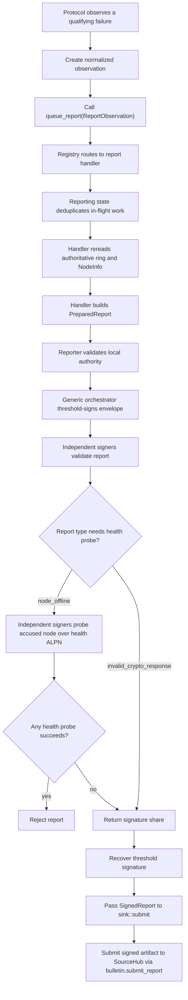

# MPC fault reporting

This folder owns the fault-reporting framework for the MPC node. Protocols such
as PRE, DKG, PSS, and signing should only submit normalized observations here;
report construction, validation, threshold signing, and delivery should stay in
this module.

Supported report types are `node_offline` and `invalid_crypto_response`. They
are intentionally small: protocols can keep serving the user while reporting
tries, in the background, to produce a threshold-signed artifact proving that a
committee member appears offline or returned an attributable bad cryptographic
response.

## High-level flow



## `node_offline` flow

1. PRE sends requests normally and continues with reachable peers.
2. If a peer-specific transport failure completes, PRE submits an
   `ReportObservation::NodeOffline(OfflineObservation)` through `queue_report`.
3. The PRE result is not delayed or changed by reporting.
4. Reporting routes the observation to `NodeOfflineHandler`.
5. Reporting collapses concurrent duplicates by the handler-owned key:
   `(report_type, ring_id, subject_key)`.
6. The handler rereads the current ring and `NodeInfo` from the bulletin instead
   of trusting the PRE call site.
7. The handler builds a canonical `ReportEnvelope` and derives
   `report_id = SHA256(canonical_report_bytes)`.
8. The reporter counts as one threshold signer because it directly observed the
   transport failure.
9. The accused node is excluded from signing, but original MPC node IDs are
   preserved.
10. Other signers independently validate the report and perform three
   challenge/response health probes over at most five seconds.
11. Any successful probe means the accused node is reachable, so the signer
    rejects the report.
12. If enough independent peers agree, the coordinator recovers the threshold
    signature under the ring key.
13. The completed `SignedReport` goes to the configured `ReportSink`.

## What qualifies as an offline observation

Only completed peer-specific transport failures should create an offline
observation:

- connection/open-stream failure;
- send failure;
- receive failure;
- response timeout.

These should not create `node_offline` reports:

- peer application errors;
- malformed responses;
- invalid shares / verification failures (these create
  `invalid_crypto_response` reports instead — see below);
- canceled stragglers after PRE already has enough shares.

The payload must stay sanitized. `NodeOffline` records only the originating
protocol/version and committee scopes. It must not include JWTs, object IDs,
ciphertexts, raw error text, or transport sub-stage details.

## `invalid_crypto_response` flow

`invalid_crypto_response` is the unified report type for attributable bad
cryptographic or authenticated protocol responses. Its canonical payload starts
with an evidence-kind tag followed by that kind's exact signed evidence.

The current evidence kinds are:

- `pre`: a signed `PreReencryptResponseStatement` for an invalid PRE proof.
  The statement domain is `orbis-pre-reencrypt-response-v1`, and
  `origin_protocol` must be `pre`.
- `sign`: a signed `SignResponseStatement` for an invalid threshold signature
  share. The statement domain is `orbis-sign-response-v1`, and
  `origin_protocol` may be `sign`, `pss_refresh`, `pss_reshare`, or `report`.
- `dkg_share`: a signed `DkgShareStatement` for an invalid raw PSS DKG share.
  The share statement domain is `orbis-dkg-share-v1`; it embeds a signed
  `DkgCommitmentStatement` with domain `orbis-dkg-commitment-v1`.
  `origin_protocol` must be `pss_refresh` or `pss_reshare`. Fresh/full DKG
  does not report bad raw shares.
- `dkg_invalid_refresh_commitment`: a signed Refresh commitment whose decoded
  constant term is non-identity. It is queued during public preflight before
  the original rejection aborts the attempt.
- `dkg_equivocation`: two signed PSS commitment statements from the same
  dealer and session nonce with different commitment bytes.
- `dkg_public_origin_fault`: one endpoint-signed invalid public contribution,
  or two conflicting endpoint-signed non-Commitment contributions from the
  same origin and attempt. The statement uses domain
  `orbis-dkg-public-origin-fault-v1`, retains the exact endpoint envelopes, and
  is limited to Refresh/Reshare. Commitment equivocation remains on the
  stronger `dkg_equivocation` path. This same `InvalidPayload` path also
  covers a Refresh result that fails preflight or dispatch over the
  `StageRefreshResult`/`CommitRefreshResult` direct-QUIC delivery barrier — a
  second, control-plane delivery route for the same `RefreshHealthCheckResult`
  contribution alongside its normal Gossip-batch path, kept reliable
  independently of Gossip.
- `dkg_leader_equivocation`: two conflicting endpoint-signed Gossip
  broadcasts (a manifest, or a chunk at the same index) from the same
  canonical public-plane leader for the same phase and coordinate. Unlike
  `dkg_public_origin_fault`, the fault is the leader's own batch-packaging
  claim, not any origin's contribution content — a leader who sends two
  different canonical manifests/chunks for one phase_root (or two different
  chunks at one index) breaks the single-canonical-batch guarantee the
  broadcast transport depends on. The statement uses domain
  `orbis-dkg-leader-equivocation-v1`, is limited to Refresh/Reshare (the
  accused committee scope follows `PrepareSession::leader_committee`: current
  for Refresh, pending-new for Reshare), and retains both raw signed
  deliveries plus each one's per-broadcast `delivery_id` (the randomized ID
  mixed into the Gossip topic-frame signing domain — see
  `crates/network/src/iroh/pubsub.rs`). Independent verification recomputes
  the topic ID from chain/ring/committee/ceremony/attempt binding and
  re-checks each endpoint signature via `PubSub::verify_topic_delivery`
  rather than trusting the reporter. A totally undecodable leader broadcast
  (fails to parse as any `DkgPublicMessage` at all) is not covered by this
  evidence kind — the endpoint signature that authenticated it at the
  transport layer is verified and then discarded before the DKG layer ever
  sees it, so there is currently nothing portable to retain for that case.

PRE, Sign, and nested DKG statements are signed by the accused node's
secp256k1 chain key (`NodeSigningKey`; the ring-registered `node_key` is exactly
that key's compressed public key hex). Public-origin and leader-equivocation
evidence instead retain the exact transport envelope(s) signed by the accused
node's registered endpoint identity. The normalized statement carries
chain/ring binding, the ring-state digest, protocol version, request/session
id, evidence timestamp, responder node key, origin protocol, and
protocol-specific material. Missing or invalid evidence signatures reject the
response or report outright; only signature-valid evidence is attributable.

When a signature-valid response fails the protocol-specific verifier, the
protocol queues `ReportObservation::InvalidCryptoResponse`. The protocol should
still continue if it has enough valid responses. Deserialization failures,
malformed evidence, bad signatures, wrong sender/recipient bindings, and stale
or future `signed_at` values are rejected without reporting.

Signer-side validation (no health probe for this report type):

- statement↔envelope binding: chain_id, ring_id, ring_pk, ring_state digest,
  `request_id == session_id`, `responder_node_key == accused_node_key`;
- evidence origin and scope policy:
  - PRE: origin `pre`, current/current committee scopes;
  - Sign: origin `sign`, `pss_refresh`, `pss_reshare`, or `report`, using the
    statement's accused/signing committee scopes;
  - DKG evidence: origin `pss_refresh` or `pss_reshare`, with current signers
    and a current or pending-new accused as permitted by the evidence kind;
- evidence signature: secp256k1 verify under `accused_node_key`; DKG share
  reports also verify the nested DKG commitment signature;
- **evidence anchor**: `observed_at == signed_at - CHAIN_BLOCK_GRACE_SECS`
  (exactly). This pins the envelope's fixed `observed_at + REPORT_TTL_SECS`
  expiry to the evidence's age, so the shared shape checks already reject
  stale or future evidence and the chain's plain TTL dedupe records provably
  outlive any resubmission of the same evidence — one accepted report per
  (request, accused, origin), ever, with no extra retention rules;
- anti-framing re-verification: signers rerun the relevant cryptographic or
  authenticated-protocol check and refuse to sign unless the embedded evidence
  independently proves the claimed fault.

For PRE evidence, signers fetch the document by object_id from the bulletin
(authoritative enc_cmt), load the local `RingPolyState` polynomial, and run
`verify()` on the evidence. For Sign evidence, signers verify the signature
share against the signed message/commitments/context. For DKG share evidence,
signers verify the share against the accused's own signed commitment and only
report if `commitment.verify_share(to_node_id, share_value)` fails.

Raw DKG bad-share reporting is PSS-only. During refresh, the receiver is a
current committee member and queues the report directly. During reshare, a pure
pending-new receiver cannot sign a current-signed report, so it relays the
signed bad-share evidence to current committee peers. A current peer accepts a
relay only for `pss_reshare`, re-checks the evidence against the local session,
confirms the share verification failure, and then queues the report itself.

Notes: `session_id` is the evidence `request_id`, so chain session-dedupe yields
per-request demerits ("keep submitting invalid crypto, keep getting
demerited"). Demerit weight is the ring's
`invalid_crypto_response_demerits` (DemeritConfig; feeds the cross-repo
ring-state digest). The signed evidence wire fields are mandatory — all ring
nodes must upgrade together. Like `node_offline`, this report attributes fault,
not intent.

## Common validation gates

### orbis-rs signer-side gates

Before anyone signs, the report handler should verify:

- the envelope domain is supported;
- the report type is registered;
- the report has not expired;
- the chain ID matches the configured bulletin;
- the ring is finalized;
- the ring public key and canonical ring-state digest match current bulletin
  state;
- reporter and accused are distinct members of their declared committee scopes;
- `NodeInfo` peer IDs match the report;
- the requester peer matches the reporter `NodeInfo`;
- the local signer is a current committee member;
- the local signer is not the accused node;
- the threshold is at least two;
- the threshold can still be met while excluding the accused node.

This means `t=1` rings cannot report faults, and `t=n` rings cannot report one
offline member using the existing threshold.

### sourcehub chain-side gates

Independently, before accepting `MsgSubmitReport` and applying demerits, the
chain re-checks most of the same invariants plus its own replay protection
(see [Chain-side acceptance](#chain-side-acceptance-sourcehub) below):

- envelope shape and validity-window checks;
- `report.chain_id` matches the running chain;
- `report_id` matches the recomputed canonical hash;
- `report_id` has not already been accepted (artifact replay protection);
- ring is finalized and `ring_pk`/`ring_state_sha256` are current;
- `origin_protocol_version` is the ring's effective version at `observed_at`;
- committee authorization (threshold >= 2, threshold satisfiable excluding
  the accused, reporter in the signing committee, accused in the accused
  committee, accused `NodeInfo.peer_id` still matches);
- session dedupe (`sessionDedupeID` has not already been accepted);
- threshold signature verifies under `ring.ring_pk`.

The chain does not trust the orbis-rs signers' validation — it re-derives
everything it can from on-chain state and only takes the threshold signature
as proof that signers agreed, not as a substitute for re-checking ring/committee
freshness itself.

## Signing behavior

Reports reuse the normal sign coordinator through a dedicated
`SignContext::Report` path.

- BLS signers perform report validation before returning their signature share.
  `node_offline` additionally performs the health probe before signing.
- FROST signers perform report validation before nonce generation.
  `node_offline` additionally performs the health probe before nonce generation.
  Round two is bound to the exact report digest through the nonce context key,
  so the signer does not need to validate/probe twice.
- The accused node is excluded from requests, expected peer sets, nonce
  collection, and final share collection.
- Exclusion is by node key, not by reindexing the committee, so MPC node IDs stay
  stable.

## Health protocol

Only `node_offline` reports use the health check. The probe uses the reporting
ALPN:

```text
orbis/reporting/health/0
```

The probe is intentionally simple:

1. signer opens a stream to the accused peer;
2. signer sends a nonce challenge and expiry;
3. accused peer echoes the nonce;
4. matching response proves reachability and rejects the offline report.

All probe failures are treated as evidence of unreachability for that signer.
One successful probe by any signer is enough for that signer to refuse the
report.

## Report sink

`sink::submit` forwards the completed `SignedReport` to SourceHub by calling
`bulletin.submit_report`. The canonical encoding is defined on the Rust side;
SourceHub mirrors the decoder and golden vectors rather than introducing a
competing encoding.

## Chain-side acceptance (sourcehub)

`MsgSubmitReport` is handled by `x/orbis/keeper/SubmitReport`, which delegates to
`validateSubmittedReport` (`x/orbis/keeper/report.go`) before applying any state
change:

1. validate envelope shape (domain, non-empty fields, `ring_state_sha256` is
   32-byte hex, `observed_at <= expires_at`, validity window is exactly the
   120s `ReportTTLSeconds`, not expired, reporter != accused);
2. `report.chain_id` matches the running chain;
3. recompute the canonical message and `report_id` from the envelope and
   compare against the claimed `report_id` — mismatch is rejected;
4. `HasAcceptedReport(report_id)` — reject if this exact signed artifact was
   already accepted;
5. decode and validate the report payload: `node_offline` checks
   `origin_protocol` is one of `pre`/`sign`/`pss_refresh`/`pss_reshare`, while
   `invalid_crypto_response` decodes its evidence kind (`pre`, `sign`,
   `dkg_share`, `dkg_invalid_refresh_commitment`, `dkg_equivocation`,
   `dkg_public_origin_fault`, or `dkg_leader_equivocation`), checks the
   expected statement domain/shape, validates origin-protocol policy, and
   binds the signed evidence to the envelope;
6. look up the ring, require it finalized, and require `report.ring_pk` /
   `report.ring_state_sha256` to match current on-chain ring state exactly
   (stale ring state is rejected, same as the orbis-rs gate);
7. check `origin_protocol_version` is the ring's *effective* protocol version
   for `observed_at` (handles upgrade-boundary timing);
8. `validateReportCommitteeAuthorization`: resolve the accused/signing
   committees for their declared scopes (`current` or `pending_new`), require
   `threshold >= 2`, require the threshold is still satisfiable with the
   accused excluded, require the reporter is in the signing committee and the
   accused is in the accused committee, and require the accused's current
   on-chain `NodeInfo.peer_id` still matches the report's `accused_peer_id`;
9. **session dedupe** — a second, independent check from `report_id` (see
   below) — reject if this `(ring, report_type, origin_protocol, accused,
   session_id)` tuple was already accepted;
10. verify the threshold signature over the canonical envelope bytes under
    `ring.ring_pk`.

Only after all of that does the keeper call `IncrementNodeDemerits` and emit
`EventReportAccepted`.

### Two distinct dedupe keys

- **`report_id`** = `SHA256(canonical envelope bytes)`, where the canonical
  bytes include every field of the envelope (domain, ids, timestamps,
  payload, `session_id`, ...). This prevents the literal same signed artifact
  from being submitted twice.
- **`sessionDedupeID`** = `SHA256(domain, chain_id, ring_id, report_type,
  origin_protocol, accused_node_key, session_id)`. This is a coarser key that
  prevents two *different* reports both claiming to cover the same session
  from landing (e.g. two honest-but-redundant submissions of the same
  underlying incident).

Both records are pruned by `EndBlock` once the report's own 120s TTL has
elapsed. That's safe to do unconditionally: the envelope's own
`observed_at`/`expires_at` window already makes the report unsubmittable past
that point regardless of whether the dedupe record still exists, so there's
no replay gap opened by forgetting it.

## Demerits

`DemeritAmountForReportType` (`x/orbis/keeper/demerits.go`) maps each report
type to a point value: `node_offline` uses
`ring.DemeritConfig.NodeOfflineDemerits`, and
`invalid_crypto_response` uses
`ring.DemeritConfig.InvalidCryptoResponseDemerits`.
`IncrementNodeDemerits` (`x/orbis/keeper/store.go`) then adds that amount to the
node's running total for `(ring_id, node_key)`. The total lives in a lazily-reset
window: if the existing window started more than `DemeritConfig.ResetIntervalSeconds`
ago, it's treated as expired and a fresh window starts at the current point total
of `amount` rather than continuing to accumulate indefinitely.

## Adding a new report type

To add another fault path:

1. define a canonical payload in `types.rs`;
2. add a normalized observation type and `ReportObservation` variant;
3. implement a `ReportHandler` that prepares `PreparedReport` and validates it;
4. register the handler in the default registry;
5. add a thin adapter at the protocol failure site;
6. call `queue_report` with the new observation variant.

The protocol module should classify and submit observations. It should not own
report envelopes, health probing, threshold-signing policy, or chain delivery.

To add another invalid-crypto evidence kind under the existing report type,
extend `InvalidCryptoResponse`, add statement shape/signature/anti-framing
validation in the handler, update SourceHub's decoder, and add matching golden
vectors on both sides.

## Test expectations

Each report type should have coverage for:

- canonical encoding and golden vectors;
- report ID/domain separation;
- expiry behavior;
- registry dispatch and unknown report types;
- in-flight deduplication and cleanup;
- stale ring state and pending reshare rejection;
- identity mismatch and self-report rejection;
- `t=1` and `t=n` threshold rejection;
- health probe success rejecting a report;
- below-threshold validation producing no signed report;
- final signature verification under the ring key for both BLS and FROST builds.
- invalid-crypto evidence kind decoding, statement binding, signature checks,
  anti-framing re-verification, and SourceHub golden vectors;
- DKG refresh direct reporting and reshare relay from pending-new receivers to
  current committee signers.
