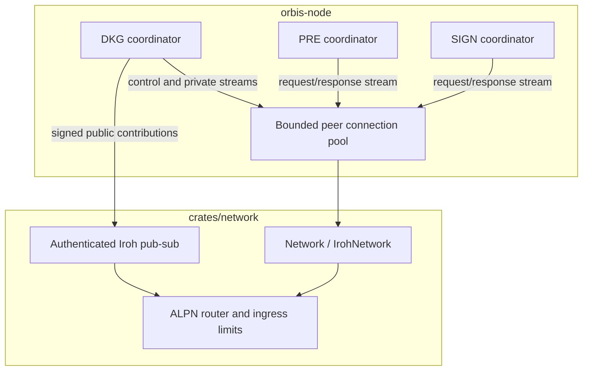

# Network crate

Trait-based networking for Orbis with a QUIC implementation built on
[`iroh`](https://github.com/n0-computer/iroh), authenticated pub-sub built on
[`iroh-gossip`](https://github.com/n0-computer/iroh-gossip), ALPN protocol
routing, bounded ingress, and length-prefixed direct messages.

This crate defines [`Network`](src/trait.rs),
[`PeerConnection`](src/trait.rs), [`Connection`](src/trait.rs),
[`ProtocolHandler`](src/trait.rs), the router traits, and the concrete Iroh
implementation in [`src/iroh/`](src/iroh/). Protocol coordinators and the
bounded `PeerConnectionPool` live in `bin/orbis-node`.

## Architecture



One Iroh endpoint hosts the direct ALPN handlers and the native Gossip handler.
`Network::connect` returns a QUIC peer connection; `open_stream` creates an
independently ordered bidirectional stream on that connection. Pub-sub topics
use attempt-derived IDs and endpoint-signed envelopes.

## Protocol routes

The v0 DKG transport has two direct routes. Public traffic uses the native
Iroh Gossip handler rather than a catch-all DKG ALPN.

| Plane or protocol | Route |
| --- | --- |
| DKG control and direct public repair | `orbis/dkg-control/0` |
| DKG recipient-specific shares and ACKs | `orbis/dkg-private/0` |
| DKG public dissemination | native `iroh-gossip` ALPN |
| PRE | `orbis/reencrypt/0` |
| SIGN | `orbis/sign/0` |
| Reporting health | `orbis/reporting/health/0` |

Route descriptors are versioned in [`src/protocol.rs`](src/protocol.rs). The
router deliberately installs only the typed DKG control and private handlers;
there is no generic DKG route.

## Direct message framing

[`IrohStreamWrapper`](src/iroh/base.rs) frames direct messages as:

```text
[4-byte big-endian payload length][payload bytes]
```

`Message::data` contains only the payload. The length prefix is added and
validated by the stream wrapper.

## Authenticated pub-sub

[`src/iroh/pubsub.rs`](src/iroh/pubsub.rs) integrates `iroh-gossip` into the
same endpoint and router. It:

- signs delivery envelopes with the Iroh endpoint identity;
- returns the verified originating endpoint to the caller;
- derives bounded topic IDs from domain-separated input;
- exposes neighbor, lag, and subscription events to the DKG transport;
- records Gossip bytes, messages, errors, and neighbor gauges.

The application remains responsible for checking the authenticated endpoint
against Vera `NodeInfo` and verifying the embedded origin signature on a
relayed DKG contribution.

## Traits and Iroh implementations

| Trait or API | Iroh type | Purpose |
| --- | --- | --- |
| `Network` | `IrohNetwork` | Connect, listen, build router, inspect bound addresses |
| `PeerConnection` | `IrohPeerConnection` | Open independent streams and close a peer connection |
| `Connection` | `IrohStreamWrapper` | Send and receive framed direct messages |
| `PubSub` | Iroh pub-sub implementation | Join, broadcast, receive verified-origin events |
| `RouterBuilder` | `IrohRouterBuilder` | Register ALPN handlers and ingress limits |
| `Router` | `IrohRouterWrapper` | Own and shut down the endpoint router |

## Features

| Feature | Default | Purpose |
| --- | --- | --- |
| `iroh` | yes | Iroh QUIC endpoint, direct connections, and router |
| `gossip` | yes | Authenticated pub-sub and native Gossip router handler |
| `fault-injection` | no | Deterministic direct/Gossip loss, reset, and neighbor-flap controls for tests |

## Ingress and resource behavior

[`NetworkIngressLimits`](src/trait.rs) bounds inbound work with two independent
admission points (`src/ingress.rs`):

- **Per accepted stream**, at `accept_bi()` in the router:
  `max_concurrent_streams` caps parked inbound streams node-wide and
  `max_streams_per_peer` caps them per immediate endpoint key. A stream that
  cannot be admitted is dropped before any byte is read. The lease is held for
  the whole stream lifetime; the read deadline below bounds how long a stalled
  stream can hold it.
- **Per decoded frame**, inside `IrohStreamWrapper::recv` (inbound streams only)
  and in the Gossip topic receiver: `max_concurrent_work` caps frames whose
  application work is executing, and `max_events_per_peer_per_second` is charged
  once per frame — so a single admitted long-lived stream cannot pump unlimited
  messages without spending its per-peer rate budget. The work lease rides on
  the returned `Message` / `AuthenticatedMessage` and is released when the
  application drops it.

`stream_read_timeout` (`IrohNetworkBuilder::stream_read_timeout_ms`, default
30 s) is the deadline for reading one complete length-prefixed frame. A partial
length prefix or a slow/partial body that misses it fails the `recv()` and
releases the stream slot, so a slow-loris peer cannot pin a slot indefinitely.
It is set above every application-level response timeout, so it only ever fires
on a genuinely stalled stream.

Separately, `max_message_size` (set on the router/connection builder — see
`RouterBuilder::max_message_size` in `src/trait.rs` and `src/iroh/router.rs`)
rejects an oversized frame before allocating its payload.

The node connection pool is bounded and LRU-evicted. DKG pair streams are
ceremony-scoped and close after the required share digests are acknowledged; PRE
and SIGN also use bounded request/response streams.

## Key invariants

- Every direct stream is authenticated by the Iroh endpoint connection.
- A new bidirectional stream has independent ordering from other streams on
  the same connection.
- Dropping `IrohStreamWrapper` finishes its send half so the peer observes a
  stream FIN rather than an unconditional reset.
- Native Gossip and direct ALPN handlers share one endpoint/router lifecycle.
- The public DKG API cannot encode credentials or recipient-specific shares.

## Metrics and tests

[`src/metrics.rs`](src/metrics.rs) exposes direct and Gossip message counts,
byte counts, errors, connection state, and Gossip neighbor gauges.
[`src/fault.rs`](src/fault.rs) decorates the same production abstractions, so
loss and churn tests do not require a production-only behavior branch.

Run the crate tests with:

```console
cargo test -p network
```
