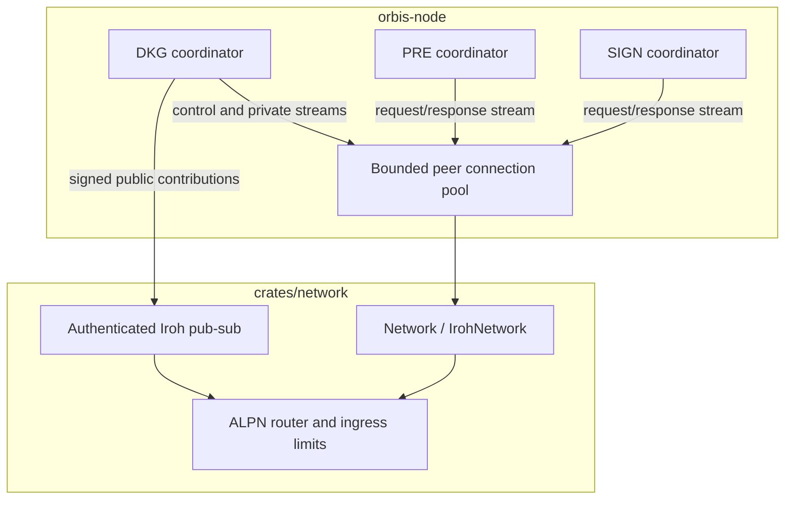

# Network crate

Trait-based networking for Orbis with a QUIC implementation built on
[`iroh`](https://github.com/n0-computer/iroh), authenticated pub-sub built on
[`iroh-gossip`](https://github.com/n0-computer/iroh-gossip), ALPN protocol
routing, bounded ingress, and length-prefixed direct messages.

This crate defines [`Network`](src/trait.rs),
[`PeerConnection`](src/trait.rs), [`Connection`](src/trait.rs),
[`ProtocolHandler`](src/trait.rs), the router traits, and the concrete Iroh
implementation in [`src/iroh/`](src/iroh/). Protocol coordinators and the
bounded `PeerConnectionPool` live in `bin/orbis-node`.

## Architecture



One Iroh endpoint hosts the direct ALPN handlers and the native Gossip handler.
`Network::connect` returns a QUIC peer connection; `open_stream` creates an
independently ordered bidirectional stream on that connection. Pub-sub topics
use attempt-derived IDs and endpoint-signed envelopes.

## Protocol routes

The v0 DKG transport has two direct routes. Public traffic uses the native
Iroh Gossip handler rather than a catch-all DKG ALPN.

| Plane or protocol | Route |
| --- | --- |
| DKG control and direct public repair | `orbis/dkg-control/0` |
| DKG recipient-specific shares and ACKs | `orbis/dkg-private/0` |
| DKG public dissemination | native `iroh-gossip` ALPN |
| PRE | `orbis/reencrypt/0` |
| SIGN | `orbis/sign/0` |
| Reporting health | `orbis/reporting/health/0` |

Route descriptors are versioned in [`src/protocol.rs`](src/protocol.rs). The
router deliberately installs only the typed DKG control and private handlers;
there is no generic DKG route.

## Direct message framing

[`IrohStreamWrapper`](src/iroh/base.rs) frames direct messages as:

```text
[4-byte big-endian payload length][payload bytes]
```

`Message::data` contains only the payload. The length prefix is added and
validated by the stream wrapper.

## Authenticated pub-sub

[`src/iroh/pubsub.rs`](src/iroh/pubsub.rs) integrates `iroh-gossip` into the
same endpoint and router. It:

- signs delivery envelopes with the Iroh endpoint identity;
- returns the verified originating endpoint to the caller;
- derives bounded topic IDs from domain-separated input;
- exposes neighbor, lag, and subscription events to the DKG transport;
- records Gossip bytes, messages, errors, and neighbor gauges.

The application remains responsible for checking the authenticated endpoint
against Vera `NodeInfo` and verifying the embedded origin signature on a
relayed DKG contribution.

## Traits and Iroh implementations

| Trait or API | Iroh type | Purpose |
| --- | --- | --- |
| `Network` | `IrohNetwork` | Connect, listen, build router, inspect bound addresses |
| `PeerConnection` | `IrohPeerConnection` | Open independent streams and close a peer connection |
| `Connection` | `IrohStreamWrapper` | Send and receive framed direct messages |
| `PubSub` | Iroh pub-sub implementation | Join, broadcast, receive verified-origin events |
| `RouterBuilder` | `IrohRouterBuilder` | Register ALPN handlers and ingress limits |
| `Router` | `IrohRouterWrapper` | Own and shut down the endpoint router |

## Features

| Feature | Default | Purpose |
| --- | --- | --- |
| `iroh` | yes | Iroh QUIC endpoint, direct connections, and router |
| `gossip` | yes | Authenticated pub-sub and native Gossip router handler |
| `fault-injection` | no | Deterministic direct/Gossip loss, reset, and neighbor-flap controls for tests |

## Ingress and resource behavior

[`NetworkIngressLimits`](src/trait.rs) bounds inbound work at several
independent admission points (`src/ingress.rs`), applied to every
router-accepted stream and to the reply read on every client-opened stream (a
reply is still attacker-controlled input under the MPC threat model):

- **Per accepted connection**, when the router's per-connection handler starts —
  for every ALPN, including the native Gossip handler, which is wrapped for this:
  `max_concurrent_connections` caps inbound QUIC connections node-wide,
  `max_connections_per_peer` caps them per endpoint key, and the open charges a
  **connection-open** rate limiter. The lease is held for the connection's whole
  lifetime, so an identity that opens connections and keeps them alive with
  transport traffic — never opening a stream — is still bounded (the 5-minute
  idle timeout does not catch this, since transport traffic refreshes it). Any
  connection refusal closes the connection.
- **Per accepted stream**, at `accept_bi()` in the router:
  `max_concurrent_streams` caps parked inbound streams node-wide,
  `max_streams_per_peer` caps them per immediate endpoint key, and the open
  charges the peer's **stream-open** rate limiter (sized by
  `max_events_per_peer_per_second`), so a peer cannot open streams — or, once at
  its cap, retry the open — faster than its budget. A stream that cannot be
  admitted is dropped before any byte is read. A **stream-open rate** refusal
  closes the QUIC connection immediately (the peer-level limiter stays exceeded
  across a reconnect, so accepting more is pure waste); a global/per-peer
  *concurrency* refusal is transient and only closes after
  `MAX_CONSECUTIVE_STREAM_REFUSALS` in a row. A malformed/oversized/EOF frame
  terminates its stream, so re-attempting costs another stream open here.
- **Per frame body**, after the length prefix is parsed but before the buffer is
  allocated: a body's bytes are reserved from a node-wide weighted budget,
  `max_inbound_request_body_bytes` for a router-accepted frame or
  `max_inbound_reply_body_bytes` for a client-stream reply — **separate pools**
  (they sum to the operator's intended total) so a backlog of stalled inbound
  requests cannot deny an incoming MPC reply its receive buffer. A body that
  cannot be reserved fails the `recv()`. The reservation rides on the returned
  `Message` for its whole lifetime, so the budget bounds
  received-but-unprocessed bytes.
- **Per decoded frame**, only once the whole body is in hand (so tokens cannot
  be pre-charged in idle windows and then banked): the peer's separate
  **decoded-frame** rate limiter is charged, then a work permit —
  `max_concurrent_work` for a router-accepted request frame,
  `max_concurrent_reply_work` for a reply frame read on a client-opened stream.
  Keeping the two work budgets separate means a request handler that fans out
  sub-requests and blocks awaiting their replies cannot deadlock by holding the
  only capacity those replies need. The work lease rides on the returned
  `Message` / `AuthenticatedMessage` and is released when the application drops
  it.

### Reserved capacity for authorized peers

`authorized_reserve_percent` (0..=100, default 0 = inert;
`IrohNetworkBuilder::authorized_reserve_percent`) is held back in **every**
shared inbound budget above — `max_concurrent_connections`,
`max_concurrent_streams`, `max_concurrent_work`, `max_inbound_request_body_bytes`
— for peers the optional [`AuthorizedPeers`] oracle vouches for (registered /
committee nodes, supplied via `IrohNetworkBuilder::authorized_peers`). An
unauthorized identity — a cheap self-issued key — must take a slot from the
matching `shared_*` sub-pool (`budget - budget * percent / 100`) as well as the
full pool, so a Sybil flood cannot starve the committee of connections, streams,
work permits, *or* body bytes — refusing at any one pool while the others held
capacity was the gap the connection-only reserve left. Authorization is sampled
at each admission (per connection, per stream, per frame), so a peer removed
from the set loses reserve access on its *next* admission; an already-held lease
persists until that connection/stream closes. The Gossip frame path keys the
reserve on the immediate relay — in a healthy committee mesh, a committee
member. The oracle answer may be briefly stale for a peer just added by an
in-flight reshare — orbis-node's oracle folds in the node's own
`NodeInfo.whitelisted_ring_ids` so a ceremony whose ring exists on-chain but has
not finished is covered, and a failed refresh keeps the last-known-good set.
Without an oracle every reservation is inert.

`stream_read_timeout` (`IrohNetworkBuilder::stream_read_timeout_ms`, default
30 s) is the deadline for each read — the length prefix and the body each get
this long. A slow-loris peer that dribbles either fails the `recv()` and
releases its stream slot. It is set above every application-level response
timeout, so it only ever fires on a genuinely stalled stream. A zero value is
rejected at build time, as is either receive-byte pool below one
`max_message_size`, or an `authorized_reserve_percent` above 100 — and
`RouterBuilder::spawn` re-checks a route-level `max_message_size` override
against the request pool.

Separately, `max_message_size` (set on the router/connection builder — see
`RouterBuilder::max_message_size` in `src/trait.rs` and `src/iroh/router.rs`)
rejects an oversized frame before reserving or allocating its payload.

The node connection pool is bounded and LRU-evicted. DKG pair streams are
ceremony-scoped and close after the required share digests are acknowledged; PRE
and SIGN also use bounded request/response streams.

## Key invariants

- Every direct stream is authenticated by the Iroh endpoint connection.
- A new bidirectional stream has independent ordering from other streams on
  the same connection.
- Dropping `IrohStreamWrapper` finishes its send half so the peer observes a
  stream FIN rather than an unconditional reset.
- Native Gossip and direct ALPN handlers share one endpoint/router lifecycle.
- The public DKG API cannot encode credentials or recipient-specific shares.

## Metrics and tests

[`src/metrics.rs`](src/metrics.rs) exposes direct and Gossip message counts,
byte counts, errors, connection state, and Gossip neighbor gauges.
[`src/fault.rs`](src/fault.rs) decorates the same production abstractions, so
loss and churn tests do not require a production-only behavior branch.

Run the crate tests with:

```console
cargo test -p network
```
