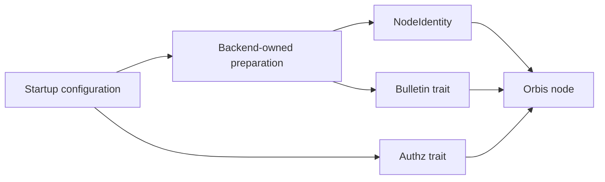

# Backend boundaries and Docker E2E tests

The node composes independently selected bulletin and authorization services in
`runtime/backend.rs`. Bulletin implementations prepare identity and worker
storage, then expose `NodeIdentity` and `PreparedBulletin`. Authorization
implementations expose `Authz`. The running node receives trait objects;
protocol handlers do not select transports or manage native worker journals.



The existing `test_cli_calls_dkg_for_pet_ring` and native PET scenarios call the
same `pet_dkg_contract::verify` through test-only backend adapters. It requires
both finalized keys to be distinct, valid and nonidentity, and binds each exposed
local polynomial's constant term to its finalized key. Adapters retain their
own certified readback and local-state waits. Existing DKG starts, authorization,
PRE checks and timeout values remain unchanged.

`test-support` owns Docker orchestration. `NativeTestNetwork` starts four Vera
validators; the node test fixture adds three normal Orbis containers using
`ContainerNode`. Each container preserves its private store for restart checks.
No test-only runtime is added to the production binary.

To run the native PET scenario, set `ORBIS_NATIVE_IMAGE` and
`ORBIS_NATIVE_VERA_IMAGE` to matching normal images from one published Orbis
revision, then pull them before running:

```sh
docker pull "$ORBIS_NATIVE_IMAGE"
docker pull "$ORBIS_NATIVE_VERA_IMAGE"
cargo +1.98.0 test --release --locked -j2 -p orbis-node \
  --no-default-features --features native,redb,iroh,bls12-381 \
  --test native_startup native_pet_threshold_workflows \
  -- --exact --ignored --nocapture
```

For Jubjub, change the feature and Orbis image together. Use normal images,
without storage KDF or deadline overrides. The native fixture provisions valid
policy and ring state through Vera and keeps the normal PSS interval of 86400.
The older five-second genesis fixture belongs to its existing backend adapter.

The [hosted gateway qualification](native-trust-hosted.md) uses the same Docker
lifecycle for the separate Go Trust service, including executable and container
packaging. It does not invoke every existing integration test. The shared DKG
extraction has passed source review and formatting checks; execution against
both backend/curve combinations remains a qualification gate.

### Trust-owned ring qualification

The hosted driver accepts `build --local-image` when the workflow runs in Trust's
repository. BuildKit loads the unchanged gateway image locally, and the transfer
archive includes that image with its SHA-256 alongside the normal executable,
verifier and compiled Go fixture. Neither the gateway image nor its build cache
is published. Restore rejects missing, extra or changed image evidence and checks
the loaded image's immutable ID before executing either fixture mode.

The run phase also accepts already-loaded immutable image IDs for the native
Orbis and Vera images. Registry references retain the existing pull path. Source,
curve, backend, production-feature labels and gateway/verifier binary equality
remain required in both paths. The existing two-mode test and deadlines are
unchanged; transport preparation alone does not establish a passed DKG run.
